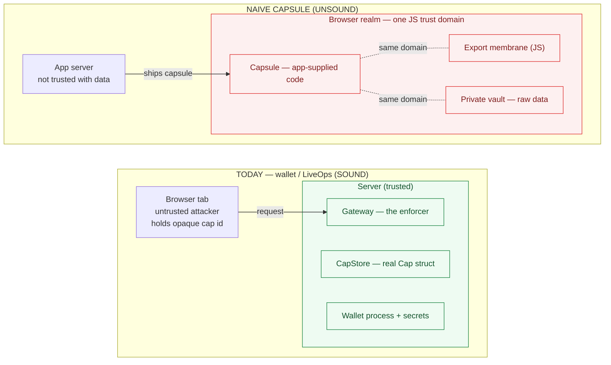
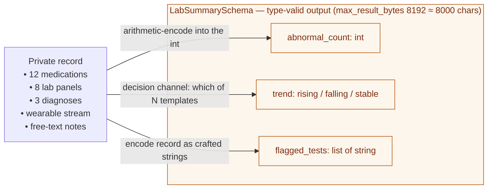
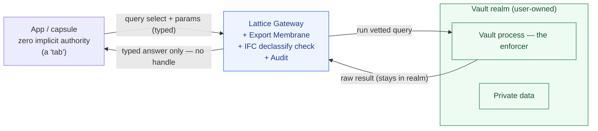
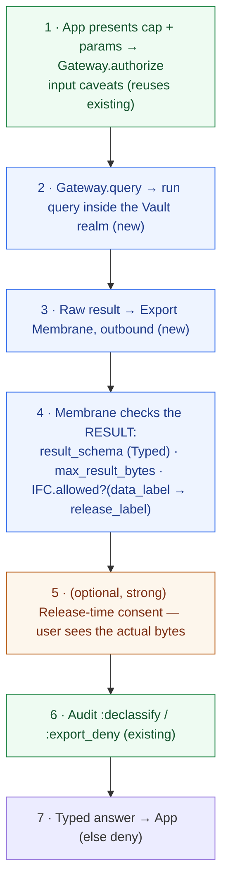
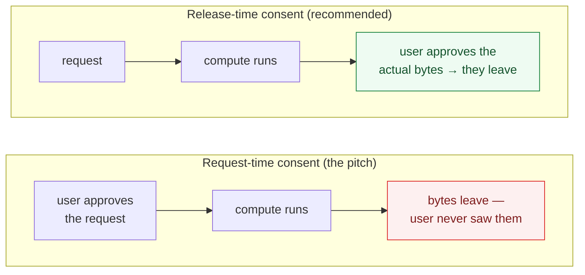

# Compute-to-Data: an adversarial review and an honest reframe

> **Lattice · design review.** Why "ship a constrained process into the private data realm" quietly inverts the trust boundary that makes today's demos sound — and the version of the idea the existing primitives can actually back.

**Scope:** critique of the proposed `Lattice.ComputeCapsule` direction + a buildable design note. Grounded in the current tree: `Lattice.Gateway`, `Lattice.Cap`/`Caveat`, `Lattice.IFC`, `Lattice.Cap.Membrane`, `Lattice.MovableProcess`, `Lattice.Audit`.

> A rendered HTML version with the same content lives at [`docs/compute_to_data_review.html`](compute_to_data_review.html).

## Contents

1. [The load-bearing objection: the enforcement boundary inverts](#01--the-load-bearing-objection-the-enforcement-boundary-inverts)
2. [Output-gating ≠ input-gating; a schema is not a leak bound](#02--output-gating--input-gating-a-schema-is-not-a-leak-bound)
3. [Most "new" primitives already exist — except the hard one](#03--most-new-primitives-already-exist--except-the-hard-one)
4. [The reframe: the data realm *is* a least-authority process](#04--the-reframe-the-data-realm-is-a-least-authority-process)
5. [Design note: wiring IFC into Cap as an outbound membrane](#05--design-note-wiring-ifc-into-cap-as-an-outbound-membrane)
6. [Request-time vs release-time consent](#06--request-time-vs-release-time-consent)
7. [Honest claim & out-of-scope](#07--honest-claim--out-of-scope)
8. [Sequencing](#08--sequencing)

---

## 01 · The load-bearing objection: the enforcement boundary inverts

Everything that works in Lattice today works because **the enforcer sits on the far side of a trust boundary from the attacker.** `Lattice.Gateway` is "the only legal path across realms," and it runs *server-side*. The browser tab holds an opaque `id`; the real `%Cap{}` with its caveats lives in `CapStore` on the server. The tab is untrusted, the server enforces, and a stolen or forged cap dies at the gateway. The browser physically cannot reach the enforcement code.

Compute-to-data flips the model: now the **data lives in the untrusted realm** (the browser) and the *app* is what you don't trust with it. So who enforces the export membrane? It has to run in the browser, beside the data. If app-supplied capsule code executes in the same JS context that can read `:labs`, then "the framework enforces what can leave" reduces to *JavaScript checking JavaScript in a runtime the capsule author influences*. There is no OS / process / language boundary there. The membrane becomes advisory.



*The inversion.* The wallet/LiveOps claim ("denied ops never reached the process") is **verifiable from the server ledger**. The capsule claim ("raw data never left the browser") is the opposite: hard to demonstrate, and the most tempting shortcut — vault actually server-side, or capsule actually run server-side on uploaded data — **looks identical in a screenshot** while inverting the headline.

> [!CAUTION]
> **Headline objection.** Compute-to-data puts the data *and* the enforcement boundary inside the realm you don't trust with the data. That is categorically weaker than the wallet demo, and it is weaker in the exact dimension the pitch markets. Given how scrupulous the docs are about non-claims ("media devices are simulated", "real Web Workers but no AtomVM"), this demo has an unusually high lie surface.

---

## 02 · Output-gating ≠ input-gating; a schema is not a leak bound

Today's caps gate *who may invoke what op on what target* — authority to **act**. `Caveat.enforce/2` runs over the *input* payload before forwarding. Compute-to-data needs authority over *what information flows out of a computation* — declassification, which is the IFC half. And `Lattice.IFC` today is a toy: a four-level GenServer that records allowed/denied transfers, not wired into `Cap` or `Gateway` at all. So the pitch leans the entire "killer demo" onto the **weakest, least-developed primitive** and renames it the membrane.

Concretely, `emits LabSummarySchema` checks *type/shape*, not *information content*:



The schema constrains the bottle, not the message in it. 8 KB is plenty to exfiltrate a real chunk of a record; the pitch's "Result Filter" hand-waves exactly this. Residual channels (encoding in allowed fields, template-choice, result timing) survive any pure type check.

> [!TIP]
> **Skipped mitigation: consent on release, not just on request.** Show the user the *actual output bytes* and have them approve the *declassification* — not a capability up front. That is the strong privacy story and it fits "the user grants." The pitch approves the request before the computation runs, so the user never sees what leaves.

---

## 03 · Most "new" primitives already exist — except the hard one

Mapping the pitch onto the current tree, `ComputeCapsule` is mostly a recombination and rename:

| Pitch primitive | Status | Already in the tree |
| --- | --- | --- |
| ConsentCapability | exists | `Lattice.Cap` — issued to one tab, scoped target/ops |
| OneTimeExecution | exists | `Cap.use_limit` / `uses` |
| ExportPolicy / ResultSchema | **partial** | `Caveat :payload_schema` + `Cap.Typed.validate` — but **input only** |
| Revocation | exists | `Cap.revoke/2`, parent/child semantics |
| TTL / expiry | exists | `Cap.ttl_ms` / `expires_at` |
| LocalAuditTrail | exists | `Lattice.Audit` |
| Export membrane | **named** | `Lattice.Cap.Membrane` — already rejects ambient-target smuggling (inbound) |
| "Move the computation" | exists | `Lattice.MovableProcess` |
| DataRealm labels / declassification | **prototype** | `Lattice.IFC` — toy GenServer, **not wired to Cap/Gateway** |
| **App-authored code run locally on private data w/ enforced output** | **not built** | — needs a real sandbox (AtomVM/WASM = your own future work) |

The genuinely new, genuinely hard part — **run app-authored code locally against private data with an enforced output membrane** — is exactly the part the server-authoritative architecture doesn't support and can't cheaply get in a browser. The pitch's novelty and its impossibility are the same sentence.

And: **"inspectable"** only survives if the capsule is declarative. A human cannot meaningfully audit arbitrary code in a consent dialog. To keep "the user sees exactly what is requested" honest, the capsule *must* be a parameterized query from a vetted catalog — a fine design, but a much smaller claim than "ship a constrained process."

---

## 04 · The reframe: the data realm *is* a least-authority process

Stop saying "ship a constrained process *into* the data." Say: **the data realm is itself a least-authority process that exposes only capability-gated, schema-bounded query operations.** The "capsule" is the attenuated cap + parameters; the *vault* (user-owned code) runs the vetted query and applies the export membrane. Put the enforcer in the vault realm — never in the app's capsule.



*This maps onto what already exists.* Vault = the authoritative process (the role the server plays today). App/capsule = a tab with zero implicit authority. `Gateway` + `Membrane` mediate; `IFC` records the declassification; `Audit` logs it. "Compute-to-data" collapses into "the data realm is a least-authority process" — *exactly Lattice's thesis*, not a new paradigm bolted on. In the browser-honest version the vault is a Worker/origin the capsule cannot directly read; the capsule may only `postMessage` a query selection — the default-deny tab topology with explicit mediated bridges you already have.

> [!NOTE]
> **The honest claim.** The app never receives a handle to the data — only a **typed, attenuated, revocable, audited answer**, and every declassification is consented and logged. That is true and demonstrable. "Raw data never leaves" is an isolation guarantee a browser can't give against the app's own code — so don't promise it.

---

## 05 · Design note: wiring IFC into Cap as an outbound membrane

Today the enforcement path is inbound only: `Gateway.call/4` → `CapStore.authorize` (which runs `Caveat.enforce/2` on the payload) → `forward_call` → returns the target's result *straight back, uninspected*. To gate output you bracket the computation with an outbound check that lives *in the vault realm*.



*Legend:* green = reuses existing · blue = new · amber = optional/strong. The membrane moves from inbound-only to bracketing the computation. The enforcer (`ExportMembrane` + `IFC`) runs in the vault realm, co-located with the data — that is the key, not the renaming.

### The honest capsule DSL (declarative, catalog-selected)

```elixir
# Not "ship arbitrary code". Select a vetted query from a catalog,
# parameterize it, and attenuate the answer.
capsule :lab_summary_90d do
  reads             [:labs]            # input authority (cap-gated)
  params            window: {:days, 90}
  emits             LabSummarySchema    # OUTPUT type
  release_label     :internal          # declassify ceiling (IFC)
  max_result_bytes  8_192
  network           false
  ttl_ms            60_000
  consent           :on_release         # approve the bytes, not just the request
end
```

### Elixir integration sketch (not in the tree)

```elixir
# caveat.ex — add OUTPUT-side caveat types alongside the input ones
:result_schema       # validated against the RESULT, not the payload
:max_result_bytes
:declassify          # {from_label, to_label} ceiling, checked via Lattice.IFC

# gateway.ex — bracket the computation with an outbound membrane
def query(tab_id, cap_or_id, params, timeout \\ 5_000) do
  with {:ok, cap}    <- CapStore.authorize(tab_id, cap_or_id, :query, params),
       :ok           <- validate_target(tab_id, cap),
       {:ok, raw}    <- forward_call(tab_id, cap, params, timeout),
       {:ok, answer} <- ExportMembrane.release(cap, raw) do   # NEW: outbound gate
    {:ok, answer}
  end
end

# export_membrane.ex — the outbound half (today's Membrane only guards inbound)
def release(%Cap{} = cap, result) do
  with :ok          <- Typed.validate(result_schema(cap), result),
       :ok          <- within_bytes(cap, result),
       :ok          <- IFC.declassify(data_label(cap), release_label(cap)),
       {:ok, bytes} <- maybe_human_release(cap, result) do
    Audit.record(:declassify, %{cap_id: cap.id, to: release_label(cap)})
    {:ok, bytes}
  else
    {:error, reason} ->
      Audit.record(:export_deny, %{cap_id: cap.id, reason: reason})
      {:error, reason}
  end
end
```

---

## 06 · Request-time vs release-time consent



Approving the *request* means the user blesses a question whose answer they never see. Approving the *release* means the human-in-the-loop reviews the exact declassified output. For a privacy demo, release-time review is the difference between a slogan and a guarantee — and it's the one mitigation that meaningfully constrains the covert channels in §02.

---

## 07 · Honest claim & out-of-scope

> [!WARNING]
> **Out-of-scope (state it like the existing non-claims).** Even with an outbound membrane + IFC + release-time consent, **covert channels within the allowed schema remain**: encoding in permitted fields, the decision channel (which template), and result timing. Treat these as out-of-scope until there is a real isolation sandbox *and* quantitative IFC — the same way the docs already say "media devices are simulated" and "AtomVM/WASM browser nodes remain future work." Mitigations that help short of that: canonical enum-only outputs (no free text), minimized result shapes, and human release review.

**Net:** the direction — making information-flow / export control a first-class Lattice concern — is the more differentiated frontier than browser clustering. Caps-as-access-control is well-trodden (object capabilities, macaroons); caps fused with IFC and a consent UI over a real cross-realm boundary is less trodden and fits the BEAM process metaphor. Just claim what the primitives can back, and put the enforcer in the realm that owns the data.

---

## 08 · Sequencing

This is a good *third lens*, not a third flagship to build now. The README already advertises a wide surface (wallet, LiveOps, research demos, stress lab). Three half-credible flagships are weaker than one bulletproof one — and this is the one most likely to ship a subtle cheat.

| Step | Do | Why |
| --- | --- | --- |
| **1** | Make the wallet flagship airtight | It already has a server-verifiable claim. Keep depth over breadth before adding a privacy story. |
| **2** | Promote IFC from toy to real | Wire `Lattice.IFC` into `Cap` as the outbound membrane in §05. Add `:result_schema`, `:max_result_bytes`, `:declassify` caveats + a `Gateway.query` path. |
| **3** | Narrow vault-realm demo | "Data realm answers attenuated queries," with release-time consent and the covert-channel limitation stated up front. Vault = user-owned process the capsule cannot read. |

---

*Design review for the `claude/private-data-capsule-demo-Y0Tse` branch. Diagrams are Mermaid (rendered by GitHub). Code blocks marked "sketch" are not in the tree.*
