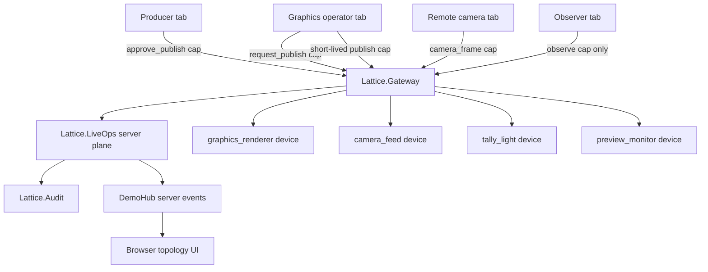

# Lattice LiveOps Demo Acceptance

The LiveOps demo is a browser-based broadcast-control scenario for explicit
authority. The browser stage is observational: it renders server events and
sends cap-bearing requests, but it does not decide authority.

## Run Under 10 Minutes

```sh
LATTICE_SKIP_DEPS=1 LATTICE_SKIP_PLAYWRIGHT_INSTALL=1 scripts/lattice_liveops_demo.sh
```

Remove the two environment variables on a clean machine when dependencies or a
Playwright browser need to be installed.

For an interactive stage:

```sh
mix lattice.liveops 4042
```

Open separate tabs:

- <http://localhost:4042/?role=producer>
- <http://localhost:4042/?role=graphics_operator>
- <http://localhost:4042/?role=remote_camera>
- <http://localhost:4042/?role=observer>

## Authority Diagram



## Proved Behaviors

| Claim | Evidence |
| --- | --- |
| Browser state is observational only | `examples/liveops_demo/client.js` sends `liveops_action` envelopes with cap ids; authorization occurs in `Lattice.Gateway`, `Lattice.CapStore`, and `Lattice.LiveOps`. |
| Roles are not sufficient authority | `apps/lattice_core/test/lattice_liveops_test.exs` denies observer publish with an observe cap. |
| Publish is denied before approval | `apps/lattice_core/test/lattice_liveops_test.exs`, `scripts/lattice_liveops_e2e.mjs`, and `mix lattice.liveops.proof`. |
| Producer approval grants a scoped short-lived publish cap | `Lattice.LiveOps` grants a `publish` cap with `ttl` and `use_limit: 1`; E2E checks the visible expiry countdown. |
| Publish succeeds after approval | Core test, stress test, deterministic proof, and Playwright E2E. |
| Replay after revoke is denied | Publish revokes the approval cap after use; tests and proof replay the cap and receive denial. |
| Expired approval is denied without sleeps | Tests and proof grant an already-expired approval cap with `ttl_ms: -1`. |
| Wrong-role publish is denied and audited | Core and stress tests assert `:liveops_denied`. |
| Device actors are cap-gated | Camera feed, graphics renderer, tally light, and preview monitor receive device-specific caps. |
| Disconnect cleanup removes actors/devices | `Lattice.LiveOps.cleanup_tab/2`, `Lattice.disconnect_tab/1`, and E2E verify actor/device disappearance. |
| Reconnect with stale caps is denied | Stress and E2E reuse stale camera authority after reconnect and assert denial. |
| Forged target and malformed envelopes fail closed | `apps/lattice_stress/test/liveops_adversarial_test.exs` covers WebSocket target mismatch and malformed JSON. |

## Artifact Paths

`scripts/lattice_liveops_demo.sh` writes:

- `output/liveops/liveops-topology.json`
- `output/liveops/liveops-topology.mmd`
- `output/liveops/liveops-audit.json`
- `output/liveops/liveops-summary.json`
- `output/liveops/liveops-e2e-summary.json`
- `output/liveops/liveops-stage.png`
- Playwright video files in `output/liveops/` when the local browser supports recording

## Limits

- State and audit history are in memory.
- This is demo-real, not production-secure.
- Browser authentication and durable audit storage are not implemented.
- Raw Erlang distribution is still not exposed to browser tabs.
- The stage simulates media payloads; it does not implement real video transport.
