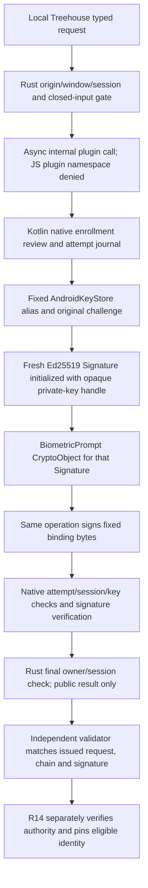

# Adopted R36 Android provider Stage 2 boundary

Adopted by the integrator on 2026-09-06 within the user-authorized unified
program, before Stage 2 implementation. Actual Claude Fable 5 reviewed the source
proposal against 4434a020: PASS, no P0/P1 blockers, with two P2 clarifications.
Both are resolved below. The proposal's requests for root adoption are satisfied;
its physical/build gates remain required, and no implementation or eligibility
result is implied by this adoption.

The strong-biometric-only per-operation profile, five exact APIs, fixed 13-field
possession claim, product-specific opaque custody/journal, refusal behavior,
source-pinned independent verifier, and proposed packet/nonce limits are adopted.
Implementation proceeds in separately reviewed slices. The first slice supplies
only the Android scaffold/carrier bootstrap and pure binding-byte interface;
subsequent slices supply protected generation/presence, usable setup and the
independent verifier. No stub may report successful protected custody or eligible
hardware, and partial slices must identify their remaining obligations.

## Existing-identity enrollment clarification

`treehouse_witness_prepare_creation` is also the explicit native-reviewed entry
for a new enrollment under an existing complete matching product identity. In
that case it stores a distinct public enrollment preparation keyed by the exact
enrollment ID and replica/recipient tuple, references the original creation
attempt and actual public key, and creates no key or generation challenge. The
native review says that the existing key is being bound to this enrollment.
An identical preparation is idempotent; reusing its enrollment ID with different
values refuses without overwriting. The store admits at most 4,096 enrollment
preparations per product, then refuses without pruning: this is a new software
metadata bound, not measured field capacity. Retained bytes count in R17b's
native storage ceiling.

`treehouse_witness_prove_binding` requires that exact native-retained enrollment
record, actual witness key and original creation attempt. The independent
validator still matches its own retained issuance request and fresh nonce; a
native enrollment record grants no authority or eligibility. For later enrollment,
export the unchanged original attestation/challenge, then prove fresh possession.
Never generate again or substitute a fresh challenge into the original chain.
Missing/corrupt/incomplete custody or enrollment records refuse. Repeated generate
is discovery/reconciliation only for the original exact attempt/challenge. R14
separately decides actual group enrollment and per-replica pinning.

## File ownership clarification

The file table below labels each group as new or edited. `lib.rs`, `build.rs`,
Cargo manifests/lock, default capabilities, App.vue, product contract and package
manifests are existing files. The named witness Rust modules, Android keyring
module, witness permission file, witness TS/Vue bridge/setup files, tests/fixture,
entire generated Android project and independent validator directory are new.
Existing preview storage/carrier identities and the Township source remain intact.

The remainder preserves the reviewed proposal as design provenance. The above
adoption and clarifications supersede its pre-adoption wording.

# R36 Stage 2 — Android witness custody and enrollment binding proposal

Prepared 2026-09-06 for integrator adoption; **no implementation or device result**.
The isolated worktree is `/Users/nicholas/develop/lattice-treehouse-r36-android-20260906`,
branch `codex/treehouse-r36-android`, at
`4434a02000e1b35211910edb45ef9b38fafdd5d4`. It remains clean. This file is outside
the repository. No source, shared ledger, device, Keychain item, private key or
network service was changed or provisioned. No build or test ran for this proposal.

## 1. Decision requested

Implement the first Android provider in the **Treehouse shell**, with one fixed
product witness identity and only the new, closed enrollment-possession purpose.
Keep Township's reviewed legacy clerk provider unchanged. Do not extract its
synchronous, clerk-only trait into a misleading general Android signer. The two
providers share the custody principles, but currently have different request
types and purposes. A later shared abstraction must follow an actual second user.

Adopt this first device profile: API 33 or later; AndroidKeyStore EC generator
with `ECGenParameterSpec("ed25519")`; TEE KeyMint; SIGN-only/DIGEST_NONE;
**strong biometric, per operation**, with enrollment invalidation enabled.
Device-credential and weak-biometric alternatives are not implicit fallbacks.
This narrows the previously open authenticator selection; it needs adoption.
A device without the complete combination is unsupported, while R12 preview
remains available. An API level, emulator, provider name or successful compile
is not eligibility evidence.

Stage 2 signs **possession of a proposed enrollment key**, not an admin, moderator,
beacon, continuation or membership authorization. R14 still verifies and pins an
eligible key under the actual group authority. R17b later implements authenticated
history, derived authority, semantic native review and the other fixed purposes.
No Stage 2 request or exported report can turn those future purposes on.

Inputs read in full or by their complete relevant amendment: native build Stages
0–6/STOPs; Stage 1 preparation/interface/evidence; Android eligibility correction;
Plan 158 native amendment at lines 128–185. These are all inherited at the base.

## 2. Actual seams and necessary scope corrections

All repository paths below are relative to the new worktree.

| Observed source | Consequence |
| --- | --- |
| `clients/treehouse-tauri-shell/src-tauri/src/lib.rs:53–82` registers six preview/carrier commands, has no governance state and no `mobile_entry_point` attribute. No `gen/android` directory exists. | Generate a Treehouse Android project from the existing pinned Tauri CLI; add mobile entry and Android-only provider registration. Merely adding a Rust trait cannot run on Android. |
| `clients/treehouse-tauri-shell/src-tauri/src/key_store.rs:4–32` retains `device-carrier-v1` under `dev.treetop.lattice.treehouse.carrier`; it is a seed-backed carrier store. | It remains separate. Android startup needs the existing native keyring-store/JNI initialization pattern to keep preview usable; this does not make the carrier key hardware-opaque. |
| `clients/lattice-mobile-core/native/src/product.rs:10–20,54–66` embeds `products.json`. | Rust selects the literal `treehouse` record in native construction. Gradle generates matching Kotlin constants from that same checked-in record. No IPC product, app ID, alias or service selector. No manifest-table schema change is needed. |
| Township `src-tauri/src/lib.rs:1032–1074,1137–1150` registers a Kotlin plugin and Android keyring store; `gen/android/.../MainActivity.kt` initializes the keyring JNI context. | Reuse the integration pattern with Treehouse identifiers, not the Township app/project or witness backend. |
| Treehouse `test/product_contract.mjs:36–49` pins the exact six commands and its parser recognizes only synchronous `fn`. | Explicitly amend it for the five named new commands and async registration, retaining all six existing commands, isolation assertions and forbidden seed/probe inputs. Do not weaken it to an arbitrary superset. |
| Tauri **2.11.5**, local `src/webview/mod.rs:1811–1900`, forwards unhandled allowed `plugin:…` invocations to mobile commands. | An `@Command` Kotlin method is not private merely because Rust usually calls it. Deny all webview calls to the internal plugin namespace and install a Rust plugin handler that explicitly rejects and consumes every such invoke. Test direct mobile-plugin invocation through real IPC. |
| Tauri `src/plugin/mobile.rs:292–320` provides `run_mobile_plugin_async`; Township's example uses its blocking counterpart. | Use the async API, not a UI-thread blocking wait or a reusable “authenticated” flag. Native lifecycle cancellation and operation ownership must survive asynchronous callbacks. |
| Existing Android scaffold pins compile/target SDK 36, min SDK 24, AGP 8.11.0, Kotlin Android 1.9.25, Gradle 8.14.3, NDK 27.1.12297006; CI uses JDK 17. | Start with those versions. Keep preview min SDK 24; guard witness calls at API 33. No Android-wide dependency upgrade is required for framework `BiometricPrompt`. |

Local metadata inspection found SDK platforms 34/35/36, build-tools through 36,
NDK 27.1.12297006 and four installed Rust Android target directories. No API-33
platform directory was found; that does not establish whether an API-33 emulator
image or physical device exists. Homebrew JDK 21 is present; a JDK-17 path must be
resolved or installed through the separately authorized build setup before the
matching Android gate. No SDK manager, emulator, adb or device probe was run.

## 3. Native identity and asynchronous API

Fixed derivation from the native manifest:

- Product/app: `treehouse` / `dev.treetop.lattice.treehouse`.
- Governance namespace: `<appId>.governance-witness`.
- AndroidKeyStore alias: `<appId>.governance-witness.v1`.
- Private control store: `Context.noBackupFilesDir/treehouse-governance-v1/identity.sqlite3`.
  It is outside R12's preview database and every webview-controlled cache API.

The alias is not an input or a returned signing handle. One product key can have
several separately bound replica enrollment records; these records do not grant
authority. The existing product limits and R14 membership rules are not relaxed.

Add exactly these top-level commands and corresponding typed TS methods:

| Command | Input and result |
| --- | --- |
| `treehouse_witness_public_identity` | No input. Presence-free, create-free read returns missing, explicit incomplete/refused status, or public key plus retained original attestation metadata. Never returns `eligible: true`. |
| `treehouse_witness_prepare_creation` | Closed proposed enrollment `{replica, enrollmentId, recipient}`. Native review accepts the exact values, creates a random creation-attempt ID, journals the public request and returns it. It creates no key. Repeated identical preparation returns the same attempt. |
| `treehouse_witness_generate` | Closed `{creationAttemptId, generationChallenge}` for that prepared attempt. Native-controlled confirmation, immutable challenge binding, then create-only generation/reconciliation. Returns public metadata marked `generated_unvalidated`; never silently rotates or refreshes attestation. |
| `treehouse_witness_prove_binding` | Closed proposed enrollment plus a fresh independent-validator nonce. Native builds the claim from actual stored identity and caller/session, reviews it, and signs that one purpose with fresh key-bound authentication. Returns the exact claim, public key, digest and signature. It does not consume arbitrary claim bytes. |
| `treehouse_witness_cancel` | Exact native attempt ID; only its actual owner can cancel it. No deletion, reset, enrollment or replacement authority. |

JSON has version 1 where versioned; reject extra fields, wrong types, noncanonical
Base64 and wrong sizes before provider dispatch. Inspect the complete Tauri IPC
body, including outer argument keys, rather than assuming a named argument's
serde parser rejects ignored outer keys; copy the validated request into owned
data before awaiting. Keys, nonces, attempt/enrollment
IDs and digests are 32 bytes; signatures are 64. Replica is nonempty valid UTF-8,
at most 512 bytes, retained exactly and safely escaped in native display. These
are a new binding-envelope shape, not a change to existing replica/wire acceptance.

Rust receives the actual Tauri webview/window handle, checks the fixed local
origin and `main` window, and derives a random launch/navigation session. No caller
label from JSON is trusted. Only that binding state can construct the sealed
`BindingSigningRequest`. No public fields, mutable byte accessor, unchecked
constructor, `Deserialize` into the sealed type, seed API or arbitrary-purpose
enum exists. The private Android bridge may serialize its fixed fields to Kotlin;
Kotlin independently reconstructs the closed bytes from its native attempt/store.
It never accepts a caller-provided payload buffer, alias or prompt.

The internal plugin is named `treehouse-witness-internal`, class
`dev.treetop.lattice.treehouse.witness.TreehouseWitnessPlugin`. It has no webview
permission. Its rejecting Rust invoke handler prevents Tauri's mobile fallback
even if a future capability were accidentally broadened. Only native
`PluginHandle.run_mobile_plugin_async` reaches it. Top-level app ACL grants the
five operations only to the existing local main window; when enabling an app ACL
manifest, explicitly preserve permissions for the six legacy commands too.

Kotlin owns platform keys, the control journal, native dialogs and each
`Signature`/`CryptoObject`/`CancellationSignal`. Rust owns webview-origin/session
validation and a final session check before returning a result. Use background
execution for file/Keystore work and the UI thread only for native UI. Hold no UI
mutex or SQLite transaction while the OS prompt is open. A per-key native
operation lock serializes cooperating processes; a second attempt returns busy.
Each callback resolves at most once. Navigation, window/activity destruction,
backgrounding, cancellation and process restart invalidate uncommitted attempts.
Test lifecycle behavior on the selected Android profile rather than assuming
desktop Tauri lifecycle events are equivalent.

Cancellation invalidates the application attempt and signals Kotlin; it does not
drop an outstanding Tauri plugin-response receiver. The pinned async helper calls
`send(...).unwrap()` on completion. Keep a native-owned task alive to drain one
terminal callback, discarding its result after cancellation/session loss, so a
late OS callback cannot panic because a webview future was abandoned. Resolve
cancel/unavailable exactly once in Kotlin, including activity teardown paths.

## 4. Fixed possession claim and call graph

Proposed canonical bytes are the existing canonical CBOR encoding of this fixed
13-element array. All strings below are **UTF-8 binary terms**, not CBOR text or
atoms; only version is an unsigned integer. Every non-string identifier is raw
32-byte binary. No map ordering or general-purpose CBOR API is introduced.

```text
[
  "lattice-witness-binding-challenge-v1", 1,
  "treehouse", "dev.treetop.lattice.treehouse",
  replica, enrollmentId, recipient,
  creationAttemptId, actualWitnessPublicKey, sha256(originalGenerationChallenge),
  freshValidatorNonce, nativeRandomNonce, nativeCallerSessionDigest
]
```

`recipient` is the exact proposed enrollment recipient/enroller public key from
the independent request. R36 binds and displays it but **does not authenticate
its group authority**. The same is true of the proposed replica target. The
independent validator matches its trusted request record; R14 subsequently
checks actual authorized enrollment. This avoids depending on R17b before R36
while making no native verified-pin or membership claim. A binding signature
cannot validate under any existing succession/beacon/continuation domain.

The native nonce is never accepted as a caller argument. Native session digest
is derived with a fixed internal domain from the actual launch/navigation nonce
and window identity. It identifies the attempt's native context, not a human.
No content-bearing group history, IMEI, serial, device-ID attestation or secret
appears in the exported packet.



Native review shows fixed product/purpose labels, complete key/replica/recipient
fingerprints and escaped exact values. It explicitly says this is proposed
enrollment/possession, not group authority. OS reason is the fixed ASCII line
`Prove Treehouse witness key possession`. Native review has the proposed
120-second limit; explicit native acceptance starts the 60-second monotonic
signing limit. No IPC synthesizes acceptance, and no accepted attempt extends
itself. Check identity/session/revision immediately before authentication, after
the blocking platform operation and immediately before release; discard any
signature computed after invalidation. These checks do not claim an R17b history
generation or semantic verdict that Stage 2 has not implemented.

## 5. Create-only persistence, ambiguity and retry

Android key generation is not a public compare-and-create transaction. Do not
assume `generateKeyPair` has Keychain's duplicate-item semantics. Under a
cooperating-process lock, check both the fixed alias and the separate journal.
Use transactional SQLite with full synchronization and a retained creation
record; ordinary reads open existing files and never call create/migrate/ensure.
Initial store creation is an explicit prepare operation. Missing journal files
when an alias exists are not first use.

| State/boundary | Required action |
| --- | --- |
| No journal and no alias | Explicit native-reviewed prepare may establish one attempt. Public read reports missing. No auto-generation at startup. |
| Prepared attempt; generation has not started | Bind the first exact validator challenge, durably mark `generation_started`, then invoke the generator once. A mismatched attempt/challenge refuses. |
| Generator succeeds | Read actual public SPKI and chain; persist raw key, exact DER chain, original challenge/attempt, fixed profile and package metadata as `generated_unvalidated` before responding. |
| Crash or ambiguous failure after `generation_started`, alias present | Reconcile only that alias against the retained original challenge and attempt, public key and exact chain. A valid journal permits completing its interrupted metadata transition; it never permits regeneration or replacement. Public read itself makes no repair writes. |
| `generation_started` with absent alias, or absent/corrupt journal with existing alias | Refuse incomplete custody. Never guess whether generation failed before insertion or a key was later deleted. No automatic retry with a new key. |
| Complete matching identity | Return the same public identity. Repeated generate is discovery/reconciliation, never generation; changed challenge cannot refresh its attestation. |
| Sidecar/key/chain mismatch, unknown store version, corrupt journal, lost key or permanent invalidation | Refuse visibly, retain evidence, never overwrite or delete. No reset/cleanup endpoint is proposed. |
| Cancel/lockout/unavailable after successful generation | Keep explicit generated-but-unvalidated state. No possession artifact or eligible identity is reported. This is not zero native writes. |

The generator's own Android implementation can perform cleanup on a failed
generation; the app cannot promise otherwise. The journal preserves the attempt
and forces ambiguity to remain explicit. Never invoke the generator against an
already observed alias. File locking protects cooperating native instances, not
an attacker controlling the app UID or the entire native store.

The independent validator first issues a random challenge for the exported exact
creation attempt and retains that issuance record. The original chain/challenge
remain stable on restart. Each later proof requires a fresh validator nonce and
native nonce under the **same key**. Mark the validator nonce spent durably when
native consent commits, including cancelled/failed signing; retries obtain new
nonces and fresh presence. Do not return an old signature as new possession or
reuse a prior successful prompt. A response lost after signing requires a fresh
proof; this packet adds no artifact/outbox-recovery API.

Proposed input bounds: eight certificates, at most 16 KiB per DER certificate and
64 KiB total chain; at most 128 KiB exported JSON; 4,096 spent-nonce records per
product, after which proof creation refuses visibly without pruning. These are
new testable bounds for adoption, not device measurements or promised lifetime
capacity. R17b must count retained control bytes in its total native ceiling.

Deleting/restoring the entire private store together with the platform identity
is outside the stated threat boundary. No monotonic hardware anchor is invented.
If both disappear, a later explicit first-use action cannot identify that loss;
an existing R14 pin must still prevent silently substituting a newly created key.
Whole-store rollback and unseen operations remain non-claims.

## 6. Exact Android operations and independent validator

The provider uses only the adopted platform construction:

```kotlin
KeyPairGenerator.getInstance("EC", "AndroidKeyStore")
// initialize with KeyGenParameterSpec.Builder(FIXED_ALIAS, PURPOSE_SIGN)
//   .setAlgorithmParameterSpec(ECGenParameterSpec("ed25519"))
//   .setDigests(DIGEST_NONE)
//   .setUserAuthenticationRequired(true)
//   .setUserAuthenticationParameters(0, AUTH_BIOMETRIC_STRONG)
//   .setInvalidatedByBiometricEnrollment(true)
//   .setAttestationChallenge(originalValidatorChallenge)
// No StrongBox request, imported key, alternate provider or attestation-key purpose.
```

Signing creates `Signature.getInstance("Ed25519")`, initializes it with the
fixed AndroidKeyStore private-key handle, and passes that exact operation to
framework `BiometricPrompt.CryptoObject`. Use the returned same operation only;
a bare success callback, another crypto object, recent unlock or reused signature
instance never authorizes signing. Provider routing and `KeyInfo` are diagnostic
checks, not substitutes for attestation. A local metadata mismatch with the fixed
TEE/authentication profile blocks the probe before signing; the independent
validator must still confirm eligibility. No private-key encoding API is needed.
Framework `BiometricPrompt` avoids an AndroidX biometric/FragmentActivity migration.
Do not add `setUserPresenceRequired` or Android Protected Confirmation flags:
those name different hardware facilities from the adopted per-use authentication.

The API choice is supported by the pinned [Android 13 generator](https://android.googlesource.com/platform/frameworks/base/+/refs/tags/android-13.0.0_r1/keystore/java/android/security/keystore2/AndroidKeyStoreKeyPairGeneratorSpi.java),
[signature registration](https://android.googlesource.com/platform/frameworks/base/+/refs/tags/android-13.0.0_r1/keystore/java/android/security/keystore2/AndroidKeyStoreBCWorkaroundProvider.java),
[KeyMint curve/purpose contract](https://android.googlesource.com/platform/hardware/interfaces/+/c07fb30b8f0d50fe8f800562cff42de5a8dc8188/security/keymint/aidl/android/hardware/security/keymint/IKeyMintDevice.aidl)
and [CryptoObject API](https://developer.android.com/reference/android/hardware/biometrics/BiometricPrompt).
The source explicitly excludes StrongBox Curve25519. The [authentication builder](https://developer.android.com/reference/android/security/keystore/KeyGenParameterSpec.Builder#setUserAuthenticationParameters(int,%20int))
documents per-use timeout zero and biometric enrollment invalidation. None proves
that a selected handset supports the combined request.

Run validation on a separate trusted computer. Recommend the official
[`android/keyattestation`](https://github.com/android/keyattestation/tree/a48898a68337b920cbd368eab5824f696d7bbf3d)
verifier, pinned at `a48898a68337b920cbd368eab5824f696d7bbf3d`, with a small
project-specific constraint/possession wrapper. Its actual build uses Kotlin
JVM 2.2.0/Java 21; isolate it from Android's Kotlin 1.9.25/JDK-17 build. Pin source,
license and dependency verification metadata before executable integration;
do not depend on an unpinned Git head or invent a Maven release coordinate.
Use a source-pinned vendored JVM subproject, preserving upstream files and adding
the wrapper in a separate source set. Dependency admission/build is a separate
first tooling gate, not evidence that the library alone enforces our profile.

The wrapper supplies exact expected challenge/attempt/enrollment/recipient and
actual public key from its independently retained request. It checks chain
signatures, certificate validity and Google trust roots, current revocation,
and the first trustworthy attestation extension nearest the root, including
provisioning-extension adjacency where applicable. It refuses an appended fake
extension or a valid chain for another key. Trust roots and revocation input come
from the validator's configured official sources, never the phone's packet.
Honor revocation-response Cache-Control; expired cache or unavailable required
trust data yields incomplete, not eligible. Record fetch times and input digests.
See [Android validation guidance](https://developer.android.com/privacy-and-security/security-key-attestation).

Use the library's strict two-security-level constraint, then explicit additional
constraints for generated origin, EC Curve25519 with SIGN-only/DIGEST_NONE,
the exact hardware-enforced `USER_AUTH_TYPE` produced by
`AUTH_BIOMETRIC_STRONG` (no password/ANY mask), absent NO_AUTH_REQUIRED/AUTH_TIMEOUT,
app package/signing-certificate identity and locked verified boot. Require exact
Ed25519 SPKI OID, absent algorithm parameters and exact 32-byte public key; a certificate's issuer-signature algorithm
need not itself be Ed25519. `USER_SECURE_ID` is non-attested. Positive per-use
fixtures omit timeout/SID; missing positive auth evidence still refuses. Validate
both authorization lists and reject inconsistent/surplus authorizations. The
actual CryptoObject probe must use the selected strong authenticator; do not
invent a separate attested sensor-strength field.
The schema and generation-time meaning are defined in the [AOSP attestation schema](https://source.android.com/docs/security/features/keystore/attestation).

The stock verifier returns a reduced security-level result; that is insufficient
on its own. Its actual `ConstraintConfig.additionalConstraints` exposes the key
description and verified path; use this seam for the full profile and produce a
closed report with each checked fact. Verify the fixed possession signature and
consume the fresh issued nonce independently. The tool's test roots/fixtures run
only in test mode and can never emit a production-eligible report.

Original attestation remains generation-time evidence after an app/OS update.
Fresh possession does not re-attest current boot or signing identity. Separate
generation-time fields, current package/device observations and freshness limits
in the report. Required current-state evidence that cannot be established remains
incomplete. R17c's exact signed-candidate physical proof is still required.

## 7. Exact proposed file ownership

`T = clients/treehouse-tauri-shell`; `A = T/src-tauri/gen/android`.

| Files (new or edited) | Work |
| --- | --- |
| `T/src-tauri/src/lib.rs` (edit); `src/witness_provider.rs`, `src/android_witness.rs`, `src/witness_binding.rs` (new) | Android mobile entry, fixed native product/caller/async API, sealed binding request, closed encoder and signature-result checking. No Core authority port. |
| `T/src-tauri/src/android_keyring.rs` (new); `T/src-tauri/Cargo.toml`, `Cargo.lock` (edit) | Separate carrier startup prerequisite, mirroring existing Township Android dependencies and fixed Treehouse service. No carrier alias/seed contract change. |
| `T/src-tauri/build.rs`, `capabilities/default.json` (edit); `permissions/witness.toml` (new) | Exact app command ACL, internal-plugin denial and product parity generation inputs. |
| `A/{build.gradle.kts,settings.gradle,gradle.properties,gradlew,gradlew.bat,gradle/wrapper/*}`, `A/buildSrc/**`, `A/app/{build.gradle.kts,proguard-rules.pro}` (new) | Generated project scaffold, pinned existing versions, product-derived constants, instrumentation wiring and fail-closed release packaging. Generated absolute-path build outputs remain untracked. |
| `A/app/src/main/AndroidManifest.xml`, `res/**`, `java/dev/treetop/lattice/treehouse/MainActivity.kt`, `java/io/crates/keyring/Keyring.kt` (new) | Treehouse-only package/resources; USE_BIOMETRIC, backup disabled, no witness-exported Activity/provider or permissive cleartext rule. No camera/link permission scope expansion. |
| `A/app/src/main/java/dev/treetop/lattice/treehouse/witness/{TreehouseWitnessPlugin,WitnessStore,AndroidWitnessBackend,BindingCodec,BindingReview}.kt` (new) | Opaque Keystore generation/signing, transactional public metadata, async UI and the closed native purpose. |
| `T/src/witness_adapter.ts`, `T/src/WitnessSetup.vue`, `T/test/witness_bridge.ts` (new); narrow `T/src/App.vue` entry, `T/test/product_contract.mjs`, `T/package.json`, `package-lock.json` (edit) | Explicit opt-in public-metadata setup panel and typed bridge; exact command/product gates. The existing preview workflow/state remain intact; no automatic witness creation or profile toggle. |
| `T/src-tauri/tests/{witness_binding,witness_bridge,witness_release_binding}.rs`, Kotlin `src/test/**`, `src/androidTest/**` (new) | Byte parity, real bridge and production-state-machine tests with private failure injection. Synthetic key material stays test-only; ordinary APK has no fake provider feature. |
| `tools/android-witness-validator/{settings.gradle.kts,build.gradle.kts,gradle/**,gradlew*,upstream.lock.json,vendor/android-keyattestation/**,src/main/**,src/test/**}` (new) | Independent verifier wrapper, pinned upstream source and dependency metadata, closed request/report tooling; no server deployment. |
| `T/test/fixtures/witness_binding_v1.json`, `apps/lattice_core/test/treehouse/witness_binding_bytes_test.exs` (new) | Public synthetic BEAM canonical oracle for the new fixed array and independent Rust/Kotlin/TS signature checks. All existing vectors remain unchanged. |
| Scoped Stage 2 roadmap/evidence after adoption | Record exact API/caps/authenticator/permission changes and factual RED/GREEN. Root owns source-plan/README/ledger and hosted workflow edits. |

Do not hand-copy Township's release signing identity. Treehouse release packaging
must use the manifest's `treehouse-pilot-v1` only in a later explicitly configured
pilot lane; no credentials/keystore exist in this proposal. Default Stage 2 CI
builds an explicitly debug-signed APK for compile/IPC tests, labeled ineligible
for candidate/device closure. Release packaging without the exact external
Treehouse configuration refuses; no silently debug-signed “release” artifact.

The setup panel is a usable entry point in the ordinary approved app, not a
hidden devtools requirement: the user explicitly opens witness setup, imports
the independent validator's public request/challenge, requests native review,
and exports public metadata/proof. Native UI makes creation/signing decisions;
the Vue panel cannot accept a review or mark a key eligible. It adds no transport,
camera/link flow, semantic group mutation or private input. Native-controlled
copy/share of the public packet is an explicit user action and never auto-publishes.

## 8. Public RED/GREEN and physical gates

| Gate | Required evidence |
| --- | --- |
| API ownership | Actual public IPC rejects bytes/key/service/prompt/unknown-purpose selectors; compile-fail checks reject manufactured/mutated sealed requests, paired with a working typed provider. Direct `plugin:treehouse-witness-internal|…` calls cannot bypass Rust. |
| Product/caller | Township/carrier aliases rejected both directions; wrong package/native product, origin, window and session refuse; public identity reads create no files/keys, perform no auth and do not repair. Existing preview commands still work under the new ACL. |
| Creation | Controlled two-process races, before/after every journal/key/chain write, lost responses and restart return the same key or explicit incomplete state. Mismatched original challenge, lost key, corrupted store and unowned alias never trigger generation/deletion. |
| Per-operation sign | Two successful proofs require two distinct CryptoObjects/authentications; cancel, timeout, lockout, background/destroy, swapped callback/Signature/key, and session/revision change during prompt/signing/release produce no result. Every retry has a new nonce and authentication. |
| Bytes/results | BEAM-generated fixed-array bytes equal Rust/Kotlin/TS; valid independent signature controls; wrong domain/recipient/replica/nonce/session/public key/digest and extra response fields refuse. No legacy clerk or beacon fixture movement. |
| Independent attestation | Real public parser inputs cover trusted positive per-use shape and forged/untrusted/revoked/substituted chains, wrong extension order, software/mixed levels, imported origin, timed/no-auth/surplus purposes, wrong package/cert/boot and documented absent timeout/SID. Validation success alone cannot skip fresh possession. |
| Artifact/build boundary | Framework APIs compile against SDK36 with API33 guard; Android tests exercise plugin registration/cancellation and native store; ordinary build has no seed import, test provider, generic witness signer or release fallback. |
| Preliminary physical eligibility | On the exact approved Treehouse APK: actual TEE Ed25519 generation, independent actual-key attestation, fresh per-use biometric signatures, cancel/lockout, reopen/reboot, biometric enrollment/invalidation and interrupted creation. Test identity-affecting cases on an explicitly designated unpinned test identity; never reset/delete an existing participant key. |

Physical output must identify APK SHA/signing certificate, package/version,
device model/API/security-patch observations, public witness key, original
challenge/chain, fresh possession proof and validator/source/trust-input digests.
Keep serials local. Unsupported and incomplete are valid recorded outcomes and
block key pinning; there is no software, P-256, StrongBox or credential fallback.
At least the two independently operated proposed witness devices must satisfy
their actual profile before R14 uses them. R36 eligibility is not R17c ceremony
or witness-independence/human-identity proof.

## 9. Build sequence after adoption

No commands in this section have been run for this proposal.

1. Generate only Treehouse's project with its locked Tauri CLI (`npm run tauri --
   android init --ci --skip-targets-install`), inventory generated files and
   reconcile versions to the existing Android baseline. Add the named mobile
   bootstrap/ACL/product-contract amendment before production edits.
2. Capture public API/byte/state-machine RED, implement each bounded slice, then
   run `cargo fmt --all -- --check`, `cargo test --locked`, shell `npm test`,
   `npm run typecheck`/`npm run build` and the new binding/bridge contracts. Builds
   use independent worktree output and pinned dependency locks.
3. From `A`, run Gradle `:app:testDebugUnitTest` and `:app:lintDebug`; build the
   arm64 debug APK through `npm run tauri -- android build --debug --apk --ci
   --target aarch64` from `T`, then `:app:assembleDebugAndroidTest`. Bind JDK17,
   SDK36 and NDK27.1.12297006 explicitly. Task/variant names are checked against
   the generated project before execution, not guessed into a green claim.
4. Build/test the separate JVM21 official-verifier wrapper with dependency
   verification and adversarial fixtures; inspect its actual additional
   constraints and current-root/revocation behavior. Run the new focused BEAM
   byte oracle with asdf/OTP28 and +S4, preserving every old vector.
5. Root adds a bounded Android debug-build/unit lane while retaining all existing
   obligations, schedules the final integrated full Mix/native gates and actual
   exact-source review, then observes exact hosted CI. No full Mix in this prep.
6. Separately authorized instrumentation/device work runs only against an
   explicit selected target and reviewed APK. Emulator results establish IPC
   choreography, not hardware eligibility. No device commands run automatically
   on connected/default hardware. R14 and R17c remain disabled until their gates.

The remaining adoption choices are concrete: strong-biometric-only profile;
the five commands and private Android project/store paths; the closed 13-field
binding bytes; journal ambiguity/refusal rules; proposed packet/nonce bounds;
and the pinned independent JVM verifier wrapper. No semantic authority change,
new plan number, new catalog signer, hardware guarantee or automatic key recovery
is requested. If an implementation needs a sixth purpose, arbitrary bytes,
unverified eligibility import, broader key deletion or a different authenticator,
return that exact change for review before implementing it.
