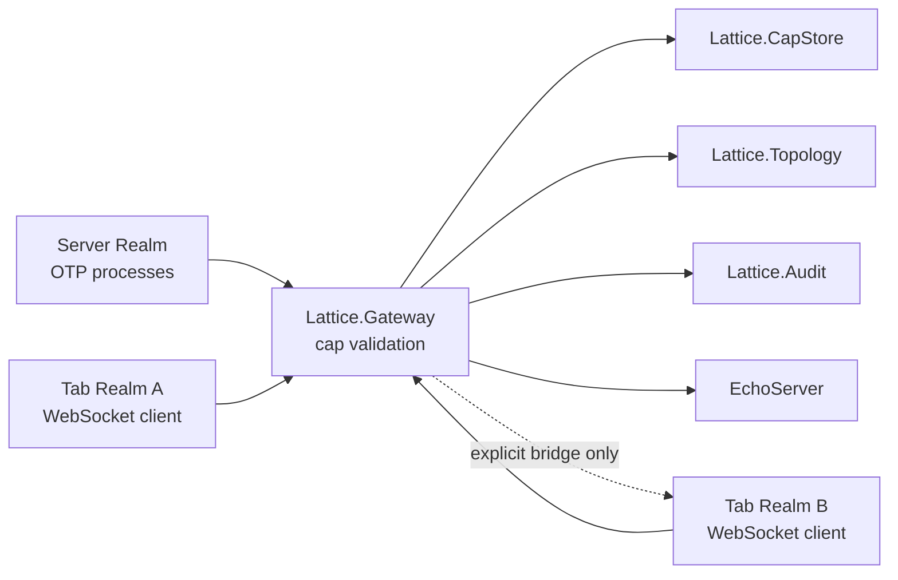

# Unified BEAM Plane POC

## Architecture

## Server Realm

The server realm hosts trusted OTP processes such as `Lattice.Demo.EchoServer`, `Lattice.Demo.SecretServer`, the capability store, topology state, audit log, and worker supervisor. Server code can issue capabilities to tabs. Tabs cannot derive server authority from process ids, registered names, node membership, cookies, or RPC.

## Tab Realm

A tab realm is represented by `Lattice.Tab`. It has a stable tab id, session id, identity metadata, transport module, connection pid, issued cap ids, owned workers, and lifecycle state. Tabs start with zero authority.

## Capability Gateway

`Lattice.Gateway` is the only legal cross-realm path. It asks `Lattice.CapStore` to authorize a cap for the calling tab and operation. Authorization checks:

- cap id exists.
- cap owner equals the calling tab id.
- cap is not revoked.
- cap is not expired.
- cap use limit is not exhausted.
- requested operation is allowed.
- tab-to-tab targets have an explicit bridge.

Denials are recorded in `Lattice.Audit`.

## WebSocket Transport

`Lattice.Transport.WebSocket` is a Cowboy WebSocket handler. It accepts JSON envelopes:

- `hello`
- `grant_request`
- `call`
- `cast`
- `disconnect`
- `tab_render_result`

The parser rejects malformed input and unknown envelope types. It does not use unsafe Erlang term decoding on untrusted browser input.

`Lattice.Transport.WebSocket.Client` is a minimal WebSocket wire client used by tests and `scripts/lattice_poc_demo.sh`. It performs an HTTP upgrade, sends masked client frames, reads server frames, and exercises the same gateway path as a browser.

`LatticeServer.DemoHub` makes the server side visible for the browser demo. It tracks connected WebSocket tabs, broadcasts presence and server events, and starts a two-tab story when a second tab joins. The story opens a short-lived bridge and sends a pulse through `Lattice.Gateway`; there is still no direct tab-to-tab networking.

## Test Harness

Core tests use small test-only client processes under `test_support` when behavior must be exercised without starting an HTTP listener. Those helpers are not compiled into the runtime library and are not part of the POC surface.

## Lifecycle Semantics

Connecting a tab creates a unique tab id and session id. Disconnecting or ejecting a tab:

- changes lifecycle state.
- revokes all caps owned by the tab.
- terminates tab-attached workers.
- records audit events.

## Topology Model

The default topology is star-shaped: tabs may talk to server targets only when granted caps. Tabs cannot talk to each other by default. `Lattice.bridge/4` creates an explicit mediated cap from tab A to tab B. Bridge traffic still goes through the gateway and transport.

In the browser story, the second tab joining triggers a bridge from A to B and then B to A. Each direction is visible in the server ledger as intent, cap opening, tab render result, and bridge return.

## MovableProcess Prototype

`Lattice.MovableProcess` models one logical process with operation-specific placement:

- `:generate_storyboard` runs on the server through `Lattice.Demo.AdPreview`.
- `:render_preview` routes to the tab through a tab-owned capability.
- `:get_state` returns logical state.

This proves a single logical handle can route work across realms while preserving cap checks and auditability.
