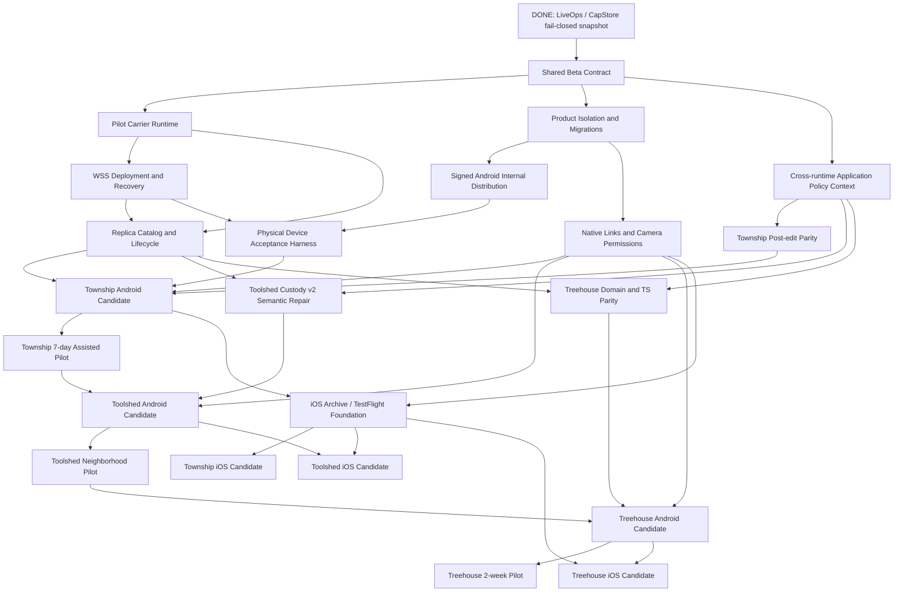

# Plan 158: Real-device beta POC program map

## Status

READY TO EXECUTE as a dependency map. This document does not itself authorize a beta claim or
erase the stop conditions below.

Planned against `origin/main` at `9b14bc8e9d483cab4ea3fc82de3e5a055aeb95f5` on
2026-07-19. The recommended product order is:

1. Township Android;
2. Toolshed after its custody semantics are repaired;
3. Treehouse after its domain and cross-runtime contracts exist;
4. iOS distribution for each product only after its Android candidate passes.

The first shared durability slice is already complete. PR #29 merged the public
`Lattice.LiveOps.snapshot/0` fail-closed CapStore outage regression, and the exact merge result
`4724dacb` passed all hosted jobs. Do not reopen or reimplement that seam in this program.

## Amendment 2026-09-01 (Plan 177)

`plans/177-group-first-antifragile-reaim.md` re-aims this map. The sections below it are kept as
written for history; where they conflict with this amendment, the amendment wins.

- **Product order.** The Treehouse-shaped durable group (under 150 people, tuned for roughly 9 to
  15) is the first product. Township moves behind it in both semantic and device delivery order.
  The recommended order in Status is superseded: after Wave A, run Treehouse Contract Correction
  and Treehouse Domain and Cross-Runtime Parity (formerly Wave D1), then the Treehouse shell,
  Android candidate and two-week pilot (formerly Wave D2), before Waves B1 and B2, so Treehouse
  reaches a device before Township does. Wave E (iOS) keeps its one-product-at-a-time rule after
  Android evidence stabilizes, but runs in Treehouse, Toolshed, Township order instead of the
  merged Township/Toolshed/Treehouse order. Toolshed Custody v2 Semantic Repair keeps its P0 and
  its position ahead of any Toolshed UI. A Toolshed custody ledger read model (per member:
  transfers, on-time returns, open return requests with epoch age, disputes) is scheduled after
  custody v2 with zero new op kinds; Plan 177 D2 (facts, never scores) governs its output.
- **Toolshed as a module.** Plan 177 proposes Toolshed as a module of the group app rather than a
  third isolated app. This is an amendment to the Product isolation contract below and is not in
  force until an operator countersign line is added to that contract, before Wave C. Until then
  the isolation table stands as merged. Isolation at the replica, catalog and manifest level is
  retained in every case.
- **Gates.** CD1 (Plans 150-152) is no longer the target gate. Plan 177 AF-1 (relay loss), AF-2
  (founder loss) and AF-3 (member device loss) replace it. Plan 150 host mode is retained as a
  privacy option only. Plan 152's LAN discovery item is dropped; QR image and deep link remain the
  only offer carriers, and `TOWNSHIP_BUILD_MAP.md` §4a is unchanged.
- **Copy.** Decision 3 copy stands for an operator-hosted relay. A member-operated relay may say
  that its readers are members' devices only when it enumerates them: the relay host device and its
  OS (including any administrator of that device), that device's backups, and every transport peer
  its manifest admits; transport allowlisting is not semantic membership. It must also say the host
  can deny service. No copy says "nothing hosted" or "serverless" while any relay persists
  plaintext, and none claims founder-loss safety until the AF gates pass. Treehouse Contract
  Correction must correct the one-pager claims "founder loss does not orphan the space" and
  "nothing hosted" accordingly.
- **Volume.** Thread rollover is the pilot compaction policy; the instrument measures per-thread op
  count and bytes against the existing 4,000-op / 8 MiB / 5-second thresholds. Production
  compaction remains excluded.
- **Status today.** AF-1 is tested by `apps/lattice_carrier_server/test/relay_reseed_test.exs`
  (member-retained copies and incremental pulls reconverge on the Sim oracle; the stale negative
  control proves only a strictly smaller served set, missing ops enumerable against the oracle and a
  frontier behind, with no divergence-reporting path). AF-2 fails by design (beacons are root-only per Plan 149; witnessed recovery in ADR 0004 covers a
  role, not the root; rotation is M3) and its decision is routed into Plan 175. AF-3 has no path.
- **AF-2 decision (2026-09-03).** The Plan 175 spike concluded: leave the legacy self-asserted
  succession tick frozen and characterized, and spend the build budget on a witness set with a
  threshold pinned at genesis, proposed to test post-founder-loss beacon advancement, opened as
  `plans/179-witnessed-beacons-af2-founder-loss.md` (effort L, risk HIGH). Founder loss is still
  not survived: root-only beacons remain the default and AF-2 fails until Plan 179's Sim test is
  green and merged, so the frozen contract sentence stands.
- **What that decision hands the witness set, recorded before the build.** Epoch advancement is the
  sole driver of Plan 149 lease lapse, so a beacon emitter can expire every expiring delegation on
  the replica, and one beacon at the canonical integer ceiling does it permanently while stopping
  the clock for every op that carries that beacon in its causal ancestry. Read that scope exactly:
  the lockout is descendant scoped, not replica wide, because the judge computes `prior_max` over
  the candidate beacon's own ancestry, so a later beacon whose `deps` fork from before the high one
  is still honored at a lower epoch on every replica (decision record sections 6.8 and 8.1). Only
  the founder's root key can do this today. Plan 179
  widens it to any threshold subset of the pinned witnesses and therefore carries two bounds on the
  witnessed epoch: a per-step ceiling pinned in the genesis beacon policy, and an absolute horizon
  fixed in both runtimes as a protocol constant, below the canonical integer ceiling and not
  settable at genesis. Neither bound removes the power inside the step. Any Treehouse
  surface that describes the witness set names that power in the same sentence as the grant, per
  Plan 177 D1. Decision record: `docs/research/succession_tick_provenance.md`.
- **What AF-2's "revoke a delegation" clause will and will not prove.** A revoke is honored only
  from the delegation issuer or the replica root, so after founder loss every delegation the
  founder issued is permanently irrevocable. Plan 179 proves the clause for delegations whose
  issuer survives, plus leased founder grants that a witnessed epoch advance can lapse, and pins
  the narrowing with a negative control. A Treehouse genesis that wants post-loss removal of a
  founder-granted member has to lease every founder-issued grant at creation time; there is no
  later repair. No beta surface may say founder-granted access can be revoked after founder loss.

## Destination

### Execution amendment 2026-09-06 (unified Treehouse R01a)

The operator's 2026-09-06 instruction to commit and complete the unified plan as proposed adopts
the core contract and scheduling choices below. The execution ledger is
`plans/roadmaps/treehouse-unified-2026-09-06.md`. Earlier ordering, baseline and immediate-next-work
sections remain historical where they conflict with this amendment. The test-pinned Plan 158 status
paragraph about Plan 178 and unrelated contract/test pins are unchanged.

1. Deliver Treehouse first, then its Toolshed module, then Township. Toolshed custody semantics may
   prepare independently, but module enablement waits for the group pilot and R01c's actual
   isolation countersign. The isolation table is unchanged in R01a.
2. Replace the historical `deploy -> catalog` dependency with local catalog/provisioning proof
   against the supervised carrier runtime; public WSS, supported backup/restore and operator inputs
   remain candidate gates. The operator, host OS administrators, backups and admitted transport
   peers can read their plaintext copies, and the host can withhold service.
3. Replace `catalog -> treehouseDomain` for R10's complete root-only BEAM/TypeScript semantic
   integration with signed catalog fixtures and a runnable offline demo. Both runtimes still merge
   together. R11 waits for R04's bounded continued-authority implementation and then supplies the
   live saga; R13 cannot enable multi-app enrollment until R11 completes. The R12 native preview
   remains local, issues no member grants, and displays `recovery_not_ready`.
4. Adopt Plan 178's exact `archive thread` amendment before R10. Archive is Thread-local and
   moderator-holder-gated, retains history/routes/slots, and leaves concurrent posts honored.
   The 12-total-Thread limit and the 4,000-op / 8 MiB / five-second pilot stop remain. Expansion
   beyond the observed cohort requires R35's measured lifecycle decision; no inclusive-150
   amendment or capacity proof is supplied here.
5. The strong candidate requires packaged and physical relay/founder/member and combined-loss
   proofs before the community pilot. R01b must separately adopt the concrete Android witness
   ceremony and scope after R17a; until then its earlier hidden-mobile-ceremony contract and
   parked-platform list remain in force. R01a itself adds no native, physical or founder-loss claim.
6. Plan 152's additional LAN/CD1 work is withdrawn. Plan 150 is the optional post-pilot host mode.
   Plan 151 supplies reusable app-owned patterns to R10-R15; any independent Township instrument
   remainder is deferred to R34. Existing helpers and their regression coverage remain.

Future packet numbers refer to this adopted sequence, not completion. New authority parameters,
social-continuity semantics, native guarantees, real custody records and external evidence remain
their named decision or verification gates. No deployment or secret mutation occurred in R01a.

### Native execution amendment 2026-09-06 (unified Treehouse R01b)

The operator's instruction to complete the unified proposal authorizes its Android/native
implementation scope. Following R17a's reviewed decision, this amendment applies that execution
authorization to the concrete build contract below. It records no additional operator signature,
eligible device, secret, distribution certificate or physical result. The reviewed sources are
`docs/research/governance_witness_native_verification.md` and
`plans/roadmaps/treehouse-native-witness-build-2026-09-06.md` at `a5d60578`.

1. Un-park Treehouse Android camera permission/pairing, cold/warm product links, internally signed
   candidate installation and physical acceptance within R13/R22. Preserve product isolation,
   recipient/replica/service checks, no bearer invitation secret and no seed-bearing QR/link.
   The supported candidate still requires its actual signing identity and unrelated physical
   devices; an emulator or debug signing is not that result. LAN/CD1 stays withdrawn and iOS
   remains separately gated by R32a. No exact-package deletion or device-data reset is authorized
   by this general scope amendment.
2. Replace the earlier hidden/deferred mobile-witness ceremony for the strong Treehouse candidate
   with the reviewed R36/R17b/R17c workflow. R36 generates a distinct protected Android witness
   identity and exports only public metadata through typed operations. Actual provider Ed25519
   generation and per-operation-authenticated signing, independently validated fresh actual-key
   attestation, hardware security levels, app identity and boot state determine preliminary
   eligibility before R14 pins a key. No software fallback, generic signer or carrier/witness
   alias crossover is admitted. Hardware/API feasibility remains unproved until measured.
   R03 also requires a configured witness key to sign the completed beacon operation. A separate
   fixed native purpose verifies the full certificate and derives the exact authority body,
   nil capability, replica/deps/epoch and same protected author before fresh presence/signing.
   It retains the signed frame crash-safely before release, permits no arbitrary operation, and
   leaves network publication to explicit later Sync using the ordinary member/carrier identity.
3. Select R17a Option A: native authentication and durable retention of complete bounded signed
   history, then the matched authority projection. Retain application ancestors, quarantines,
   competing branches and authenticated unsupported-history blocking state. Native review derives
   full replica identity and exact intent; consent is single-use, caller/session-bound and checked
   again after blocking platform operations. Signing from an older supplied subset, a missing or
   corrupt native store, or stale consent refuses. Whole-native-store rollback and unseen withheld
   operations remain explicit non-claims.
4. Authorize R17b's precise Plan 146 Seam 5 extension for the existing closed CarrierTerm/op
   grammar needed to verify complete history, with BEAM/TS/Rust bytes, IDs and rejection parity.
   Record the corresponding scoped Plan 146 amendment in the atomic R17b build. Existing clerk
   claim bytes remain fixed; arbitrary general CBOR, generic signing and new Core semantics are
   excluded. R17b consumes the landed R03/R04 contracts and retires claim-only IPC atomically.
   Android is the selected strong-candidate witness platform; macOS Keychain seed retrieval and
   its outstanding codesigning/presence proof remain a distinct existing platform track.
5. Adopt the fail-closed build gates, without calling their proposed constants measured: 8,192
   operations/16 MiB witness-retention ceiling, five-second cold verification targets including
   near-ceiling restart/refusal, 500 ms incremental target and proposed 60-second consent TTL.
   Exact byte accounting and minimum-device measurements precede readiness; changing a target
   requires a reviewed profile decision. An active attempt never extends itself. This amendment
   does not adopt R02's field lease cadence or invent a viable Android hardware combination.
6. Keep the order acyclic: R01b scope -> R36 preliminary custody eligibility -> R14 enroll/pin ->
   R17b integrated signing -> R17c independent physical ceremony. R12 remains a local root-only
   preview; it issues no member grants or recovery claim. An unsupported device, missing retained
   proof or failed ceremony blocks the affected readiness gate while independent preview work
   continues. The constant-prompt maintenance fix remains independently landable before this build.

The exact authorization source and review/verification evidence are recorded in
`plans/roadmaps/evidence/treehouse-r01b-2026-09-06.md`. This amendment changes the relevant scope
and deferred-ceremony requirements, not the earlier program's historical evidence.

Produce three honest beta proofs of concept that can be installed on real phones, use a public
WSS carrier without a development tether, retain identity and replayable state through reboot and
upgrade, converge after offline work, and expose enough local audit evidence to explain a refusal.

"Beta POC" means all of the following for the named product:

- an internally distributed, non-debug-signed Android release;
- a product-specific package ID, deep-link scheme, native key-store service, database file/schema,
  and migration history;
- a public WSS endpoint backed by durable identity and log storage, health checks, secrets handling,
  and a rehearsed backup/restore procedure;
- no localhost, `10.0.2.2`, `adb reverse`, build-time identity, environment-seeded peer, or bundled
  demo-state dependency in the user path;
- successful Wi-Fi, cellular, offline/reconnect, app force-stop, phone reboot, signed in-place
  upgrade, carrier restart, and carrier restore checks;
- convergence on two unrelated physical phones; a phone plus an emulator or desktop is useful
  engineering evidence but is not the final mobile gate;
- exact-tip PR CI and exact merge-result `main` CI green for every dependent slice.

This is an assisted, bounded pilot. It is not a claim of high availability, centerless operation,
E2EE, background delivery, autonomous recovery, or general production readiness.

## Live baseline

### Repository and branches

- `main` and `origin/main` are `9b14bc8e`; PR #30's exact tips were green when it merged, and all
  three jobs on its exact merge-result workflow `29706169249` are green.
- There are no open PRs.
- The only surviving non-main implementation branch is
  `codex/wip-witness-ceremony-seam10` at `b3b9a61a`: clean, 24 commits behind and one WIP commit
  ahead of `main`, with no PR. It is outside this beta foundation and must not be merged wholesale.
- Plans 150-152 are desktop centerless-demo drafts. They explicitly exclude public TLS, physical
  Android, and iOS, so they are not prerequisites for this program. Plan 151's app-owned instrument
  work and Plan 152's offer/admission/grant separation are reusable design inputs.

### Physical Device A proof

The default release APK at exact `main` was built with
`npm run tauri:android:build:release`, installed, and launched on a Google Pixel 6 Pro running
Android 16 / API 36 (`arm64-v8a`). No `adb reverse` rule or build-time probe configuration was
present. The installed app remained alive and its native device key initialized.

The result is an engineering baseline, not a beta:

- the APK is signed by the Android debug certificate;
- APK SHA-256 was `95f88f95d2ffeefeb940c964ace97fb3d3b9fae62f1cc0beb576c96b51ecb659`;
- the fresh app displayed the bundled `Zoning Variance #24` fixture as an 11-op locked matter even
  though no carrier pairing existed;
- the app could not create or join a real remote matter from that clean state.

Keep the full ADB serial out of committed evidence. Select it locally through `ANDROID_SERIAL` and
record only model, OS/API, ABI, app version, git SHA, APK hash, signing fingerprint, network class,
and redacted outcome.

### Product readiness

| Product | What is real now | Why it is not a real-device beta |
|---|---|---|
| Township | Tauri/Vue Android shell, native key custody, local persistence seam, WSS-capable client, root authoring primitive, pairing/QR/deep-link pieces, direct actions, reactive verified feed | Fresh install renders fixture state; one fixed replica/namespace; no app database/migrations; no deployed WSS carrier; debug release signing; no Android CI artifact; no two-device/reboot/upgrade evidence |
| Toolshed | BEAM `Shed`/`Tool`, Sim storyline, read model, custody-consent helper, lease tests, one TS consent mirror/vector | Two P0 semantic binding failures; admission/refusal policy gaps; no TS product realm, app, UI, package, storage, QR ceremony, distribution, or device evidence |
| Treehouse | A tracked product one-pager | No Elixir domain, TS realm/vector, shell, UI, package, workflow, carrier composition, or device artifact |

## Decisions that keep the first beta bounded

1. **Pilot topology.** Use one small Linux host with a supervised release behind a TLS edge such
   as Caddy. Reuse the existing single-replica carrier boundary. A manifest starts one isolated
   carrier instance per pilot replica and maps an opaque WSS route to each loopback listener.
   Do not build a new multiplexed protocol in this beta. A signed product catalog maps replicas to
   routes and the expected service fingerprint; catalog publication is the last step of a
   recoverable provisioning saga, never a claim that an unprovisioned route exists.
2. **Assisted provisioning.** A local `pilotctl`-style Mix task validates a founder-exported
   genesis bundle, initializes a replica log, adds public transport peers to a manifest, and
   performs a controlled restart. There is no public carrier-admin API in the first beta.
3. **Carrier trust claim.** The carrier is transport and durable custody of signed bytes, not
   semantic authority. It may observe plaintext and deny liveness. E2EE is deferred; product copy
   must say so.
4. **Township editing.** Honor the requested posting/editing scope literally: the first beta includes
   author-only editing of an existing post as a new parity-atomic semantic slice, in addition to the
   existing matter title/summary edit. Moderator editing, post deletion and edit-history compaction
   remain deferred.
5. **Toolshed time.** Due dates use a monotonically increasing, tool-root-signed UTC-day epoch
   authored by an explicit root-only foreground ceremony. The UI labels it as an accountable signed
   assertion, not an ambient trusted clock. Offline devices show the last honored assertion and do
   not infer a new day from wall time.
6. **Treehouse invitations.** Invitations are recipient-bound, scoped and revocable. They are not
   time-limited or use-limited in this beta: the v2 delegation has neither an independently useful
   clock nor a distributed use counter. Reusing the same invitation is idempotent; rebinding it is
   invalid.
7. **Sync.** Foreground/manual sync is acceptable for the first pilots. Background delivery and
   notification guarantees are deferred.
8. **Scale.** One Township matter, one Toolshed neighborhood with at most 20 Tool replicas, and one
   Treehouse community with at most 12 Thread replicas are sufficient for the first assisted pilots.
   The host refuses a 65th total replica route. A phone keeps at most four foreground WebSockets and
   round-robins foreground/manual sync for the rest. Compaction and HA remain out of scope.

## Product isolation contract

These identifiers are defaults for the first implementation. A change requires updating the
collision contract before any product shell lands.

| Product | Android/iOS app ID | Deep-link scheme | native key service | database | Android signing alias |
|---|---|---|---|---|---|
| Township | `dev.treetop.lattice.township` | `township://` | `dev.treetop.lattice.township.carrier` | `township-v1.sqlite3` | `township-pilot-v1` |
| Toolshed | `dev.treetop.lattice.toolshed` | `toolshed://` | `dev.treetop.lattice.toolshed.carrier` | `toolshed-v1.sqlite3` | `toolshed-pilot-v1` |
| Treehouse | `dev.treetop.lattice.treehouse` | `treehouse://` | `dev.treetop.lattice.treehouse.carrier` | `treehouse-v1.sqlite3` | `treehouse-pilot-v1` |

### Toolshed module amendment and operator authorization (2026-09-06, R01c)

The standalone Toolshed row above is retained as a reserved legacy identity, not the identity of
an enabled module. For the unified Treehouse program, Toolshed runs inside Treehouse with this
concrete collision contract:

| Boundary | Adopted module contract |
| --- | --- |
| App and links | `dev.treetop.lattice.treehouse` and `treehouse://`; Toolshed routes are module routes validated within that product. `toolshed://` cannot select Treehouse storage or signing. |
| Member key service | Retain `dev.treetop.lattice.treehouse.carrier`. Governance-witness keys use the separately protected Treehouse namespace owned by R17a/R36; module activation cannot select a different product's key service. |
| Database and migration | Retain `treehouse-v1.sqlite3`, its Treehouse product marker and migration ledger. Add module tables/namespaces through reviewed migrations; do not open or relabel `toolshed-v1.sqlite3`. |
| Distribution lineage | Retain `treehouse-pilot-v1`, its pinned signing fingerprint and supported upgrade path. Module activation does not create a second app, alias or distribution lineage. |
| Semantic boundaries | Shed/Tool replicas, catalog entries and permissions stay explicit. Membership in a Treehouse Space does not automatically grant authority or reading access to a Tool replica. Validate each signed operation against its own replica and role/capability rules. |
| Reserved legacy identities | Keep the standalone Toolshed app ID, scheme, carrier key service, database and pilot alias reserved and collision-tested. They remain dormant for this program; no automatic import, migration or signing bridge is authorized. Township remains independently isolated. |

Operator countersign / authorization record: on 2026-09-06, Nicholas instructed, “In that new work
tree commit that proposal and working together with Claude Fabel for code reviews and
implementation assistance complete that new plan as proposed”. The already-written unified
proposal's R01c and R26 explicitly selected the retained Treehouse identities, module namespaces
and reserved legacy identities above. This record applies that instruction to this concrete
contract; it is not a claim of a cryptographic signature or a new authorization inferred from
future design work.

R26 owns production manifest, native/TypeScript collision tests, database/module implementation
and the complete Toolshed reader/host copy correction. Before that packet passes, current runtime
product records stay unchanged and this amendment establishes no enabled module or pilot result.
R26 still requires the completed group pilot, custody semantics, catalog and profile dependencies
in the unified ledger. iOS, external credentials and device evidence remain separately gated.

Each database has its own migration ledger and product marker. It stores replayable frames,
delegations, outbox entries, profiles, replica metadata and user-visible drafts. Signing seeds stay
only behind the platform key-store command boundary. A shell must fail closed if the database's
product marker does not match its app, a migration is interrupted, or a future schema is opened.

Required migration tests are fresh install, current-schema reopen, interrupted migration rollback,
one supported N-1 to N upgrade, future-schema refusal, and cross-product file refusal. Every
physical upgrade gate checks that the same public identity and replayable state survive.

Each Android product uses a separately backed-up pilot alias and pinned certificate fingerprint,
even if the encrypted keystore container is shared. The build manifest selects exactly one alias;
cross-product signing is refused in CI. Backup, restore and planned rotation are rehearsed before
distribution. iOS uses product-specific bundle IDs and provisioning profiles under the reviewed
team certificate, with the same provenance and rotation record.

## Dependency map

The arrows are merge dependencies, not a ban on research in parallel. No dependent implementation
branch may merge before the parent ticket's merge-result `main` workflow is green.

## Shared foundation tickets

### Shared Beta Contract

**Type:** task. **Owner:** root integrator. **Status:** this plan.

Freeze the scope, product identifiers, beta claims, assisted-provisioning boundary, evidence format,
and stop conditions. Update the stale Toolshed/Treehouse M2 language and record the deliberate
un-parking of physical Android and later iOS without widening Plans 150-152.

**Exit:** written review finds no claim of production security, E2EE, HA, centerless operation,
trusted time, bearer use limits, or a two-phone result based on an emulator/desktop substitute.

### Pilot Carrier Runtime

**Type:** task. **Owner:** carrier agent.

Create a production Mix release and manifest-driven supervisor around the existing
`LatticeCarrierServer` instances. Replace the current seed-in-command-line entrypoint with
fail-closed secret-file loading. Add unauthenticated `/livez` and content-free `/readyz`; readiness
requires identity load, recurring on-disk source restore/validation, and listener availability for
every instance, plus writable durable storage for relay-enabled instances. Keep `/carrier`
application authentication unchanged.

Strengthen the path-backed acknowledgement boundary for the supported Linux host so an accepted
relay survives process restart and host reboot. Require the supported filesystem path to flush the
new file, atomically rename it and `fsync` the containing directory before acknowledging; a platform
that cannot prove that sequence is unsupported for the pilot. Missing/corrupt identity, manifest or
log must refuse startup rather than create a new community.

**Tests:** invalid/missing secrets; corrupt/missing manifest/log; multiple isolated replica
instances; health state transitions; restart from the same paths; no identity in argv/logs; relay
persist-before-ack; injected interruption before/after rename and directory sync; abrupt process and
supported-host reboot persistence.

### WSS Deployment and Recovery

**Type:** task. **Owner:** operations agent after Pilot Carrier Runtime.

Ship a reproducible single-host deployment with TLS termination, automatic certificate renewal,
loopback-only carrier listeners, persistent volume mounts, least-privilege service account,
read-only application image, secret-file mounts, structured logs, resource limits, and health
checks. Expose only HTTPS/WSS. Record the service public-key fingerprint out of band.

Add assisted provisioning/admission tasks and an immutable operations runbook. Create a consistent
encrypted backup at least daily, with a signed cutoff manifest containing every replica frontier and
hash; the pilot disaster RPO is 24 hours. Back up the service and catalog signing identities encrypted
and separately. The restore drill starts on a clean host, reproduces the same fingerprint and exact
cutoff, then keeps readiness false while admitted clients replay locally held signed ops after that
cutoff. It proves an already-installed app can authenticate, replay, pull and converge after the
original service is unavailable. Ordinary process/host restart has a zero-loss acknowledged-op
contract; clean-host disaster restore may require client replay and does not claim zero loss for a
post-cutoff op that survives on no admitted client.

**Exit:** public WSS from Wi-Fi and cellular; valid certificate; cleartext public refusal; no
acknowledged op lost across ordinary carrier/host restart; clean-host restore reproduces its declared
cutoff and reconciles client-held post-cutoff ops; `/readyz` fails during corrupt/incomplete restore;
backup age alert; documented credential rotation and pilot shutdown.

### Replica Catalog and Lifecycle

**Type:** task. **Owner:** carrier/catalog agent. **Dependencies:** Pilot Carrier Runtime and WSS
Deployment and Recovery.

Define one signed **transport catalog** per product. A dedicated per-product Ed25519 catalog key is a
transport-only authority: the operator generates it, the founder reviews its public key and service
fingerprint, and a product-root-signed bootstrap op commits that key before the first replica is
provisioned. The private key exists only in the carrier secret mount and encrypted signing-key backup;
clients verify every catalog signature through the root-bound bootstrap. Normal rotation requires the
old key to sign the new key and cutoff; loss recovery requires a new founder/product-root ceremony and
never silently trusts a regenerated operator key.

Each entry binds product, schema version, replica ID, replica kind, opaque WSS route, expected
service-key fingerprint and creation op. A catalog signature does not make a Tool or Thread
semantically visible and confers no product authority: the product replica must contain its own
honored reference, and every child replica still needs transport admission and an exact-audience
semantic grant. An extra transport entry is ignored, a referenced replica with no route is shown
unavailable, and any entry whose product/replica/fingerprint mismatches the semantic reference is
refused. Join bundles carry the current transport catalog plus only the recipient's
admissions/grants. New-replica notifications carry a newly signed catalog entry. The
operator may fan out transport removal, but it never authors semantic revocations. A product removal
coordinator records the required per-replica revocations and obtains signatures from each authorized
issuer; until then it exposes exactly which semantic grants remain unresolved.

Implement operator-only `pilotctl add-replica`, `add-peer`, `remove-peer`, `status` and `reconcile`.
They stage and validate a new manifest, initialize or open the exact durable log, atomically activate
the route, probe readiness, then publish the signed catalog entry. Manifest reload/restart must not
drop an acknowledged op. Backup/restore covers every catalog, route manifest, carrier identity and
replica log as one inventory, and refuses a partial or mismatched restore.

The client provisioning saga is durable and retryable: `local_draft -> genesis_created ->
carrier_pending -> listed`, with `unavailable` as an explicit recoverable display state. Inject a
crash between each transition. Retry may not produce duplicate genesis, duplicate routes, phantom
inventory/thread entries or a catalog entry whose carrier is not ready. A partially completed member
removal is shown as `removal_pending`; transport removal retries automatically, while each semantic
revocation remains pending until its actual issuer signs it. No operator/service key may impersonate
a product issuer.

**Limits:** Township has one Matter; Toolshed has one Shed plus at most 20 Tools; Treehouse has one
Space plus at most 12 Threads; the host has at most 64 active routes; a phone has at most four live
foreground sockets. Boundary tests cover the exact limits, recovery, a new replica appearing after a
member joined, removal fan-out, extra/missing/mismatched transport entries, and deterministic
foreground round-robin sync. Trust tests cover wrong/unknown signer, cross-product key use, rollback,
normal rotation, lost-key founder recovery and restoration of the same encrypted catalog key.

### Cross-runtime Application Policy Context

**Type:** correctness task. **Owner:** BEAM/TS substrate agents; one parity-atomic PR. **Dependency:**
Shared Beta Contract.

Add a pure, log-aware application-policy seam before either new product contract. On BEAM, introduce
`command_op_status/3` with `(op, visible_ids, context)`, where `context.visible_ops` contains only the
op's causal past indexed by ID and `context.verdicts` contains each prior op's deterministic
`:honored` or quarantined reason. Compute those verdicts in causal/canonical order, so a policy can
require an honored target without inspecting a concurrent/future op or recursing through itself.
Keep `/2` as a compatibility adapter for existing modules: default `/3` calls the module's `/2` with
`visible_ids`. The callback may derive a causal product view from those bytes and prior verdicts but
may not read a process, database, network or wall clock. Give TypeScript the same causal context and
reason vocabulary.

Pin validation precedence as: structural quarantine; malformed/unknown command; capability;
authority holder; application policy. Within application policy, missing/not-causal target precedes
author/party mismatch, which precedes product-state conflict. Union application-denied IDs with the
authority quarantine before BEAM reduction and TypeScript materialization; no denied effect may
partially apply. Legacy `/2` modules retain their current reasons.

Add a separate pure `command_conflicts/3` full-frontier callback after individual causal validation;
the default returns no conflicts. It receives the complete structurally accepted DAG, causal
verdicts and ancestry, groups individually honored product ops by their conflict key, and returns
deterministic loser reasons. This phase alone may
compare concurrent ops; it never makes an individually denied op valid. A partial frontier may
provisionally honor an op and reclassify it when a canonically earlier concurrent winner arrives, so
BEAM and TypeScript must recompute the complete union before materialization and emit the same audit
transition. Validation reasons retain the precedence above; conflict-loser reasons apply last.

**Exit:** exported adversarial vectors prove a policy can inspect the exact referenced causal op,
can distinguish an honored target from a structural/authority/application-quarantined one, cannot see
a concurrent/future op, emits the same pinned reason in both runtimes, and excludes the same ID from
both materialized states. Full-frontier vectors deliver concurrent conflicts in every order and prove
the same winner, loser reason and partial-frontier reclassification after sync and dump/restore.

### Product Isolation and Migrations

**Type:** task. **Owner:** shared mobile-runtime agent.

Extract only the product-neutral native signer, database, outbox, carrier, pairing and QR seams from
Township. Introduce the product manifest and collision test above. Add native, transactional SQLite
storage with a per-product file and migration ledger; migrate Township's supported JSON state once,
without moving private seeds out of the key store.

**Exit:** Township remains behaviorally green; all three product manifests are unique; cross-product
scheme dispatch and database/key access refuse; migration matrix passes on desktop and Android.

### Signed Android Internal Distribution

**Type:** task. **Owner:** Android/CI agent.

Replace release debug signing with an external pilot keystore supplied only through CI secrets.
Generate monotonic version codes, a signed universal or ARM64 APK, SHA-256, signing fingerprint,
git SHA and machine-readable build manifest. Add hosted Android build, signature verification,
artifact upload and install/upgrade smoke. Set a real CSP and enforce WSS-only non-loopback peers in
release builds. Compile out dev traces, environment probes and seeded-key paths.
Official main builds occupy a disjoint high version-code band. Secret-free/branch builds occupy a
low band that is monotonic along each first-parent branch; different branches may share a code, so
git SHA plus APK SHA-256—not versionCode alone—identify the exact build.

Device A currently has the exact-main debug-signed baseline installed. Android will not accept a
pilot certificate as an in-place update for that package ID. The harness must detect the signer
mismatch, capture only baseline signing/device metadata, stop, and request explicit operator approval to
uninstall only `dev.treetop.lattice.township`; that one-time reset intentionally discards the dev key
and fixture state. The first pilot certificate is then a clean install. Only later pilot-signed
N-to-N+1 builds count as identity/database-preserving upgrade evidence.

**Exit:** `apksigner` reports the pinned pilot certificate rather than `CN=Android Debug`; a clean
install and signed N-to-N+1 upgrade work on Device A; the same artifact is downloadable by testers;
no secret appears in logs or artifacts.

### Physical Device Acceptance Harness

**Type:** task. **Owner:** device-QA agent; this agent alone controls ADB while a run is active.

Build a small harness that takes `ANDROID_SERIAL` locally, installs an exact artifact, checks reverse
rules, launches, confirms pre-stop process liveness, force-stops, and records only allowlisted structured outcomes,
network class and versions, and emits an immutable JSON/Markdown evidence bundle keyed by git SHA,
APK hash, capture time, and run identity.
Raw screenshots and general logcat are never persisted. A release run fails before contacting ADB
unless the artifact matches an explicitly supplied non-debug pilot-certificate pin, and fails if any ADB
reverse mapping exists; it never deletes a mapping it did not create. If a dedicated dev subtest
creates a mapping, the harness records and removes only that exact owned mapping. It may use ADB for
install, observation, force-stop and reboot; the app's data or carrier path may not use ADB.
After install, the harness pulls signed `base.apk` and requires its signer and SHA-256 to match the
pre-install artifact exactly; an OEM-denied pull is recorded as unreadable, not as a byte mismatch.

Destructive `pm clear` or uninstall is a separate clean-install/signing-lineage case and requires
explicit operator approval for the exact package. Upgrade/reboot tests preserve app data. The harness
must never log private keys, capability payloads, pairing QR contents, full device serials or user
content.

**Exit:** Device A passes build/install/launch/force-stop/upgrade mechanics; a second unrelated
Android is registered before any two-phone beta verdict.

### Native Links and Camera Permissions

**Type:** task. **Owner:** shared native-mobile agent. **Dependency:** Product Isolation and
Migrations.

Add Android `CAMERA` declaration plus runtime request/status/regrant handling through the Tauri/WebView
boundary, and add each iOS target's `NSCameraUsageDescription` plus equivalent native permission
bridge. Queue a product-scoped deep link received during cold start until the database and key store
are ready. A scan/link is untrusted input: decode, product/replica/signer validation and an explicit
human review all complete before any profile, admission, grant, request or outbox entry is persisted.

**Exit:** unit/native tests and physical gates cover denial, denial-with-"don't ask again" where
applicable, Settings regrant, warm/cold launch, interrupted camera, wrong-product link and malformed
payload. Every refusal has zero durable side effect. Android proof runs on Device A; iOS code lands
with the shared boundary but its physical proof remains part of the iOS candidate.

### iOS Archive and TestFlight Foundation

**Type:** task. **Owner:** iOS distribution agent. **Dependencies:** first Township Android candidate
and Native Links and Camera Permissions.

Add production bundle IDs, schemes, Keychain services/access groups, signing/provisioning through
CI secrets, versioning, archive/export, TestFlight upload and artifact provenance. Prove physical
Keychain identity and database persistence through force-quit, reboot and upgrade, then deep-link,
camera and WSS behavior on a real iPhone.

**External prerequisites:** Apple Developer team/App Store Connect credentials and a physical iOS
device. Simulator process-relaunch evidence is not a physical beta gate.

The shared foundation unlocks only Township iOS. Toolshed iOS additionally depends on the Toolshed
Android Candidate, and Treehouse iOS additionally depends on the Treehouse Android Candidate; a
shared archive pipeline is not product readiness.

## Township route

### Township Empty Boot and Profiles

**Owner:** Township storage/profile agent. **Dependencies:** Product Isolation and Migrations.

Replace the bundled matter preview with an honest empty/onboarding state. Remove production fallback
to environment peer configuration. Add a profile catalog, per-matter database namespace derived
from the root-bound replica, active-matter selection, and explicit stale/unavailable states.

**Exit:** a fresh exact release shows no fictional matter; storage errors do not fall back to an
environment fixture; multiple local matter profiles do not cross-read; the same profile reopens
after force-stop and reboot.

### Township Create/Join and Assisted Provisioning

**Owner:** Township enrollment agent. **Dependencies:** Township Empty Boot and Profiles, WSS
Deployment and Recovery, and Replica Catalog and Lifecycle.

Before genesis, the operator produces a non-secret catalog-key/service-fingerprint proposal. The
founder reviews it on-device, creates a root-bound matter offline with the existing genesis primitive,
and commits that transport-only key in the root-signed bootstrap before exporting a public signed
provisioning bundle. The operator validates and provisions it on the pilot carrier. A joiner
imports strict WSS pairing material, generates its own keys, requests transport admission, pulls and
verifies genesis, and then receives an exact-audience v5 semantic grant.

Keep three moments separate in UI and tests: pairing offer, carrier transport admission, semantic
grant. No private key, seed or capability secret may appear in QR, deep link or provisioning bundle.

**Exit:** founder creates the pilot matter on Device A without a seed; guest joins on a second
client; unadmitted cannot authenticate; admitted-but-ungranted cannot author; wrong replica/server
fingerprint/extra field/tampered bundle refuses.

### Township Post-edit Parity

**Owners:** Township BEAM/TS semantic agents; one parity-atomic PR. **Dependency:** Cross-runtime
Application Policy Context.

Add `edit_post_v1` with the root post op ID and replacement text in the signed command. The target
must be an honored causally visible Township post in the same matter and the editor must be its
original author. Each edit continues to cite the root post; concurrent honored edits resolve by the
existing canonical ordering, retain the same post identity and keep the original plus every edit in
audit. Other-author/moderator edits, delete/tombstone and relative text patches are outside this beta.

**Exit:** BEAM Sim/export and TypeScript vectors match for ordinary and concurrent edits, offline
heal and dump/restore; missing/concurrent/quarantined/wrong-matter/wrong-author target refuses with a
pinned reason; an authorized edit cannot surface a quarantined fake post.

### Township App-Owned Beta Instrument

**Owner:** Township instrument agent. **Dependencies:** Township Empty Boot and Profiles and Township
Post-edit Parity; may proceed in parallel with the carrier after its interface freezes.

Adapt Plan 151 to the beta scope. Create local intents for post, author-only post edit, title/summary
edit, roster admit/remove, grant and revoke, and route them through the existing review, native sign,
persist, outbox and explicit Sync ceremony. Render only locally verified state: matter, post edit
history, roster, holders, quarantine/refusal reasons, connection freshness and exact audit-bundle
export.

Hide elections, succession, centerless hosting, governance witness controls and demo/probe controls
from the first beta. Label post edit separately from matter title/summary edit.

**Exit:** no Phoenix process is needed; every action is locally authorized or visibly refused;
carrier-reported authority never becomes state; exported bytes pass outsider replay.

### Township Android Candidate

**Owner:** Android integration agent. **Dependencies:** Township Create/Join and Assisted
Provisioning, Township App-Owned Beta Instrument, Signed Android Internal Distribution, Physical
Device Acceptance Harness, Native Links and Camera Permissions and Replica Catalog and Lifecycle.

Integrate the production WSS profile and publish the first internally signed Township artifact.
Run Device A first, then two unrelated phones.

**Physical gate:** create/join; post, author-edit that post, and title/summary edit; roster;
grant/revoke; read/audit; both
Wi-Fi and cellular; offline author then reconnect; app force-stop; both phone reboots; signed
upgrade; carrier restart; clean-host carrier restore; acknowledged outbox drain; revoked and
ungranted actions visibly refused; both devices and outsider audit converge. Submission is
at-least-once: retries are expected, content-addressed acceptance is idempotent, one op produces one
semantic effect, and the outbox drains only after acknowledgement.

### Township Seven-Day Assisted Pilot

**Owner:** pilot/operations agent. **Dependency:** Township Android Candidate.

Run one matter with 5-10 people for seven days. Provide an onboarding script, support channel,
redacted diagnostic export, incident log, daily backup check and reset/recovery procedure.

**Exit:** no unexplained state loss/divergence, key reset, unauthorized visible command, duplicate
materialized effect, stuck acknowledged outbox or failed recovery drill. Retransmitting the same
content-addressed op is normal. Elections, succession, centerless operation and HA remain deferred.

## Toolshed route

### Toolshed Custody v2 Semantic Repair

**Owner:** custody-contract agent plus TS-parity agent. **Dependencies:** Cross-runtime Application
Policy Context and Replica Catalog and Lifecycle. Township pilot completion controls candidate/pilot
ordering, not this contract work.

This is a P0 gate. Today consent proves only that a recipient signed bytes containing an arbitrary
causal ancestor ID, and the read model chooses an unrelated latest lease as the due date. Freeze a
hard-cut v2 wire shape, canonical consent bytes, failure precedence and legacy behavior before
building UI. Deliver it in three ordered PRs; each PR includes its Elixir projector/policy, Sim
vectors, TypeScript decoder/projector and adversarial parity tests atomically:

1. the shared deterministic callback/context prerequisite above;
2. `custody_offer_v2`, `custody_request_v2` and `custody_transfer_v2`, including exact due binding;
3. invitee-bound admission plus `custody_decline_v2` and pinned decision projection.

Custody v2 must enforce all of these:

- the referenced op exists in the transfer's causal past and is the exact signed custody request;
- request kind/ref/body, direction, `from_pub`, `to_pub`, tool/replica, loan terms and cited grant
  match the transfer and the recipient's canonical consent bytes;
- borrow requester is the recipient and command author is the current physical holder;
- return requester is the borrower and command author is the receiving holder;
- `from_pub != to_pub`, and the causal effective holder matches `from_pub`;
- a borrow cites a visible, honored, leased grant addressed to borrower/`to_pub`; its exact grant ID,
  signed due epoch and terms are bound into the request, consent and final transfer. The grant must
  be active at the borrow's causal position;
- a return cites the exact active borrow transfer and its original grant; that grant remains addressed
  to borrower/`from_pub`, not receiving owner/`to_pub`. Return validates the historical honored-borrow
  binding and does not require the original grant to remain unexpired or unrevoked afterward; an
  overdue tool must remain returnable. Loan A cannot close loan B;
- the ordinary custody-authority/holder gate remains independent of consent and must also pass;
- one request ID resolves to at most one honored transfer. If concurrent otherwise-valid transfers
  cite it, the full-frontier conflict phase selects the lowest canonical op ID and every other
  candidate gets `:custody_request_already_resolved` in both runtimes, including after a higher ID
  was provisionally visible on a partial frontier;
- admission is bound to the invitee's public identity;
- an explicit decline is authored by the same current/receiving holder who could complete the exact
  request and cites that request ID. Projection is `completed` if an honored transfer exists,
  otherwise `declined` if an honored decline exists, otherwise `pending`; absence is never decline,
  and a later or concurrent decline cannot hide completion;
- legacy v1 bytes decode and remain auditable but are beta-quarantined with the pinned
  `:legacy_custody_v1` reason. Migration preserves raw bytes and never crashes or silently reinterprets
  a historical v1 transfer as v2.

Add a root-only foreground `Assert current day` action. It previews the signed UTC day and provenance
before authoring a beacon. Refuse unauthorized signer, rollback and duplicate day; require an extra
confirmation for a large forward jump. Loss of the root device leaves the last honored day visible
and blocks new due-date claims; it does not fall back to wall time.

**Adversarial exit:** unrelated genesis/grant/command cannot masquerade as request; wrong author,
party, direction, tool, loan or grant refuses; same-party transfer refuses; unrelated lease cannot
change due; revoked/expired/wrong-audience grant refuses a new borrow, while overdue and
post-borrow-revoked loans remain returnable; consent mutation/replay refuses; return requires both
parties; unauthorized/stale/rollback beacon cannot change overdue; invite rebinding refuses;
duplicate/large-jump day paths are explicit; pending is never labeled declined; all v1 logs load
without a crash and remain excluded from beta custody state with the pinned reason.

### Toolshed Isolated Shell

**Owner:** Toolshed shell agent. **Dependencies:** Toolshed Custody v2 Semantic Repair, Product
Isolation and Migrations, and Replica Catalog and Lifecycle.

Create the Toolshed package with its own IDs, scheme, key service, database and migrations. Add TS
authoring/projection for Shed and Tool replicas and consume the signed multi-replica catalog. Tool
creation uses the durable provisioning saga; a Tool is not listed until its carrier route is ready,
and an interrupted item is visibly local-draft/carrier-pending/unavailable. Fresh boot is empty and
does not import Township data.

Each Tool genesis names its owner/root and authorized grant issuer; the Shed steward and carrier
operator do not thereby gain that authority. Removing a neighbor removes Shed membership and every
transport admission immediately, then creates owner-visible per-Tool revocation requests. Each Tool
owner signs its own revocation ceremony. Until all owners do so, the app lists unresolved semantic
grants per Tool and makes no global-revocation claim.

**Exit:** signed empty shell installs beside Township on Device A; packages, links, keys and database
files cannot collide; BEAM/TS state and quarantine match the exported vectors; removal tests cover
two Tool roots, one offline owner, immediate transport refusal and eventual issuer-signed revocation.

### Toolshed Product Workflows

**Owner:** product-flow agent. **Dependency:** Toolshed Isolated Shell.

Build the bounded screens: join/vouch, inventory list, tool detail, description and condition,
request, explicit decline, borrow, signed due day/provenance, overdue, return, dispute/audit and
steward view. The root-only day assertion has a review/provenance screen and explicit offline/root-key
loss behavior. Defer photos and NFC.

**Exit:** a user can list a real tool and complete every state without a fixture, environment peer
or localhost endpoint; pending/declined/completed are unambiguous; due always comes from the cited
loan.

### Toolshed QR Co-Signing

**Owner:** ceremony agent. **Dependency:** Toolshed Product Workflows.

Implement a QR-first two-phone state machine for borrow and return. Bind QR payloads to product,
schema version, tool replica, exact request, parties, direction, loan/grant and one-time ceremony
state. `one-time` is the causal single-resolution rule above, not a scanner cache. A QR may have a
local UX timeout, but the beta makes no distributed expiry claim. Show human-readable terms before
each local signature. Reject resolved/replayed, tampered, wrong-product, wrong-tool, wrong-party and
wrong-loan payloads.

The complete network-free borrow ceremony is:

1. the owner authors and durably stores an exact-audience leased grant plus `custody_offer_v2`, then
   displays offer QR A;
2. the borrower scans A, verifies/imports the grant and offer, reviews the exact terms, durably stores
   the exact request plus canonical consent, then displays response QR B;
3. the owner scans B, verifies causal grant/request/consent and current-holder authority, then durably
   stores the final transfer and displays receipt QR C;
4. the borrower scans C, verifies the same final op and durably stores it. Later carrier sync is
   convergence, not the first durable copy on the second phone.

Return uses the same three-QR shape but cites the active borrow transfer and original borrower grant;
it must not manufacture a grant addressed to the returning owner.

**Exit:** in airplane mode with both apps warm and terms already reviewed, time starts when the
borrower confirms response B and ends when both phones have durably stored and rendered the identical
final transfer after C. Three consecutive camera-only runs complete in under ten seconds each. Setup
and human reading time are recorded separately. Carrier sync may retransmit, but content-addressed
storage and projection converge to one semantic effect.

### Toolshed Android Candidate and Neighborhood Pilot

**Owner:** device-QA agent, then pilot agent. **Dependencies:** Toolshed QR Co-Signing, WSS Deployment
and Recovery, Signed Android Internal Distribution, Physical Device Acceptance Harness and Native
Links and Camera Permissions.

**Physical gate:** Device A lists a real tool; Device B joins and borrows it; Wi-Fi/cellular and
offline/reconnect work; key, inventory, open loan and outbox survive force-stop, reboot and upgrade;
carrier restart/restore converges; exact due survives unrelated grants; two-party return and
explicit decline work; refusal/dispute is visible; a third independent client reconstructs the
same audit. That auditor is Device C: a third physical phone with fresh app data and its own key, not
a desktop/emulator. Tampered/replayed/wrong-loan QR refuses. Both custody phones display and camera-scan
real QR codes with the network disabled; ADB/deep-link injection is forbidden. Deny and regrant camera
permission, repeat from warm and cold launch, and retain the three timing records and redacted camera
evidence.

After the gate, run one neighborhood with 5-8 households for 7-14 days. The one-pager's later
two-neighborhood/90-day proof remains out of this POC.

## Treehouse route

### Treehouse Contract Correction

**Owner:** Treehouse domain agent.

Correct the one-pager before code: M2 substrate exists but product runtime/deployment is missing;
invites are not use-limited; the plaintext pilot relay is hosted and observable; it cannot decide
semantic authority or erase device-held history, but it can withhold availability. Freeze the
text-only command vocabulary, conflict rules, roles and beta exclusions.

Status 2026-09-03: corrected and frozen in `plans/178-treehouse-contract-correction.md`; the
one-pager copy and the contract sentences are pinned by
`apps/lattice_core/test/treehouse/contract_test.exs`.

### Treehouse Domain and Cross-Runtime Parity

**Owners:** Treehouse domain agent plus TS substrate agent; one parity-atomic integration PR.
**Dependencies:** Contract Correction, Cross-runtime Application Policy Context and Replica Catalog
and Lifecycle. BEAM and TypeScript work may be prepared as separate commits/worktrees, but no
BEAM-only product contract merges or enables before the integration PR contains both runtimes and
their shared vectors.

Implement `Treehouse.Space` for name, members, capability-authorized Thread references, invitations,
admin role,
revocation and succession. Implement `Treehouse.Thread` for title, posts, author edits, author
tombstones and moderator tombstones. Extend the shared TS decoder with product injection and
delete-aware causal-list reduction.

When one signed command derives multiple field mutations, retain one op ID, one DAG node, one
authorization decision and one quarantine decision. Represent its ordered derived mutations as
`effects[]`; never explode them into duplicate semantic ops. An existing singular effect normalizes
to a one-element array. The signed command bytes determine the complete ordered array in both
runtimes, and validation/reduction is all-or-none: if any effect is malformed, unauthorized or
application-invalid, none of the effects apply. Canonical encode/decode and byte-vector parity cover
both singular and multi-effect forms.

Use `command_op_status/3` to inspect only causal `context.visible_ops` and `context.verdicts`. The
policy requires every referenced post/edit in the target lineage to be honored, belong to the same
Thread and have the right kind; a quarantined fake post cannot become visible through an otherwise
authorized edit. An author edit/tombstone must be signed by the honored root post's author; a
moderator tombstone uses a distinct command whose authority effect makes the whole op
moderator-holder-gated. Pin missing/not-causal target, quarantined target, wrong target kind/thread,
wrong author and already-tombstoned reasons in that order. Union those application-denied IDs with
authority quarantine before either reducer runs.

Concurrent edits resolve by the existing canonical op ordering; a causally visible tombstone is
irreversible and wins over every edit. Admin/moderator changes carry authority-field effects so the
complete command is holder-gated. Role transfer, revocation, succession and stale-holder refusal use
existing authority semantics. Treehouse pins **witnessed succession** in genesis, including the
witness set/threshold and evidence rules; dormant-tick succession is not enabled. Witnessed
succession is implemented and covered by Sim/export/replay, but its mobile ceremony is hidden and
deferred in the first beta, so the device gate exercises manual role transfer only. Unfinished Plan
146 is reusable witness-artifact work, not a dependency for this mobile candidate.

An honored Space command makes a Thread reference semantically visible; the separate transport
catalog maps that replica to route and service fingerprint. A missing route renders the honored
Thread unavailable, an extra route without an honored Space reference is ignored, and mismatched
replica metadata refuses. A join response contains both current sets plus per-Thread transport
admissions and exact-audience semantic grants. Creating a Thread uses the catalog provisioning saga
and publishes the Space reference only after the route is ready; the new reference, route and grants
propagate to existing members. Member removal revokes Space and every current Thread grant and
removes transport admission across the catalog, exposing `removal_pending` until reconciliation
completes.

**Exit:** membership/invites/roles/revocation/succession plus posts/edits/tombstones are deterministic
through partition/heal, dump/restore, role transfer and stale moderator attempts; new-Thread and
member-removal fan-out recover after injected crashes; extra/missing/mismatched routes do not change
semantic visibility; an authorized edit of a quarantined target remains quarantined; every existing
Township and Toolshed vector remains green; Treehouse effects, application quarantine and authority
quarantine match BEAM byte-for-byte.

### Treehouse TS Realm and Isolated Shell

**Owner:** Treehouse client/shell agent. **Dependencies:** Treehouse Domain and Cross-Runtime Parity,
Product Isolation and Migrations.

Add Treehouse authoring, projection, persistence and carrier composition, then a separate shell
with the IDs in the isolation table. Build create/join, thread list, text post/edit/tombstone,
offline queue, members/roles, connection health and audit UI. Fresh boot is empty.

Use recipient-bound join request/response QR or deep-link exchange: the joiner creates its own keys,
the admin admits the transport key and signs exact-audience membership/role grants for Space and the
current Thread catalog. No bearer authority or secret crosses the link. An invitation has one signed
ID and recipient; replay is idempotent, rebinding is quarantined, and revocation closes it. It has no
beta expiry or distributed-use-limit claim.

### Treehouse Android Candidate and Two-Week Pilot

**Owner:** device-QA agent, then pilot agent. **Dependencies:** Treehouse TS Realm and Isolated Shell,
WSS Deployment and Recovery, Signed Android Internal Distribution and Physical Device Acceptance
Harness, and Native Links and Camera Permissions.

**Physical gate:** phone-to-phone QR/deep-link join, including camera-permission denial/regrant and a
cold-start deep-link; wrong-recipient, wrong-replica, wrong-server, tampered, replay-rebound and
revoked invitations refuse. Two phones post and edit offline then heal; deterministic tombstone
behavior; admin/moderator manual transfer; stale old-moderator quarantine; revocation denies a
causally later post; force-stop, both reboots and signed upgrade retain identity and history; carrier
restart/restore resumes convergence; Wi-Fi and cellular both pass; audit export matches an
independent client. Genesis-pinned witnessed succession remains domain/replay evidence, not this
device claim.

Run one small community for two weeks. Defer notifications, background-delivery guarantees, media,
bots, federation, E2EE, automated recovery and the one-pager's larger multi-community/60-day gate.
Before inviting testers, load Device A with 5,000 attachment-free ops / 10 MiB of log and require
three force-stop cold opens to render verified state within five seconds each. That load lives in a
separately named disposable benchmark profile containing no pilot identity/content. After capturing
evidence, an explicitly approved app-owned profile deletion removes only that namespace; the device
then creates a fresh below-limit pilot profile. During the pilot stop new posting at 4,000 ops, 8 MiB,
or any cold open over five seconds and export evidence; this leaves headroom because production
compaction is not integrated.

## Four-slot subagent schedule

There are four concurrent slots including the root coordinator. Use fresh worktrees from the last
green `origin/main` and `codex/beta-*` branches. Root owns dependency decisions, shared-interface
freezes, PR publication, review closure, merges and hosted CI evidence.

### Wave A1: shared foundation

- **Carrier agent:** Pilot Carrier Runtime.
- **Mobile-runtime agent:** Product Isolation and Migrations.
- **Device/CI agent:** Signed Android Distribution plus non-destructive Device A harness baseline.
- **Root:** contract, shared file ownership, integration and merge queue.

### Wave A2: deployment, catalog and policy context

- **Operations agent:** WSS Deployment and Recovery.
- **BEAM policy agent:** `command_op_status/3`, context construction and RED vectors.
- **TS parity agent:** mirrored context/reasons and vector consumer on the same policy PR.
- **Root:** integrates the parity-atomic policy PR; when deployment is green, reassigns the first free
  worker to Replica Catalog and Lifecycle.

Only one agent may edit each hot file: workflow YAML, lockfiles, generated mobile projects,
`carrier.ts`, vector exporters and shared native state.

### Wave A3: native enrollment boundary

- **Native-mobile agent:** product-scoped links and Android/iOS camera permission bridge.
- **Catalog agent:** finishes lifecycle/recovery after deployment.
- **Device/CI agent:** integrates pilot signing lineage and non-destructive harness behavior.
- **Root:** cross-product permission/refusal review and merge queue.

### Wave B1: Township semantic and enrollment

- **Storage/enrollment agent:** Empty Boot and Profiles, then Create/Join.
- **BEAM post-edit agent:** author/target policy and exported RED vectors.
- **TS post-edit agent:** decoder/projector parity on the same integration PR.
- **Root:** parity-atomic post-edit integration and enrollment interface freeze.

### Wave B2: Township Android first

- **Instrument agent:** App-Owned Beta Instrument including post-edit UI.
- **Android integration agent:** WSS/distribution integration and Device A evidence.
- **Adversarial/device agent:** permission, wrong-target, offline, reboot and second-phone cases.
- **Root:** merge order, final two-phone gate and pilot handoff.

### Wave C: Toolshed

- **Custody-contract agent:** Elixir contract/read model/ADR and RED cases for the current ordered
  semantic slice.
- **TS-parity agent:** consumes the frozen wire/reason contract and exports/matches vectors on the
  same slice's PR.
- **Adversarial reviewer:** read-only unilateral-return, unrelated-grant, replay, invite-rebinding
  and beacon attacks; later becomes device-QA owner.
- **Root:** integrates each of the three parity-atomic semantic PRs in order, then opens the
  shell/workflow/QR PR queue.

### Wave D1: Treehouse semantic truth

- **Domain agent:** contract correction, BEAM domain and vectors on an unmerged integration branch.
- **TS substrate agent:** ordered effects, causal delete and product decoder on the same integration
  branch.
- **Adversarial reviewer:** target authorship, partial-effect, catalog fan-out, invitation and stale
  moderator attacks.
- **Root:** lands one cross-runtime semantic PR only after all vectors agree.

### Wave D2: Treehouse app and device

- **Realm/UI agent:** Treehouse authoring, projection and bounded screens.
- **Shell/carrier agent:** product-isolated shell, catalog enrollment and WSS composition.
- **Device-QA agent:** signed Device A candidate, then two-phone negative and convergence gates.
- **Root:** merge queue, performance envelope, pilot stop decision and handoff.

### Wave E: iOS

After Android evidence stabilizes, reuse the three worker slots for distribution, product
integration and physical iOS QA, one product at a time in Township/Toolshed/Treehouse order.

## External go/no-go inputs

Local Wave A code may start, but the named gate cannot pass until its operator-owned inputs exist:

- **Carrier deployment:** one supported Linux host with administrative access and a filesystem that
  passes file-plus-directory-sync tests; a controlled DNS name; inbound TCP 443/firewall approval;
  outbound certificate-renewal access; and an owner for patching, alerts and shutdown.
- **Recovery:** an encrypted off-host backup destination, scoped credentials, a separately held
  encryption/recovery key, a clean restore host and an operator who accepts the 24-hour disaster RPO.
- **Carrier secrets:** service identity, one root-bound catalog signer per product, TLS/ACME material
  where applicable and peer-admission manifests, all supplied through secret files with an inventory,
  custodian, encrypted backup and rotation/recovery record.
- **Android distribution:** the three pilot aliases, certificate fingerprints, keystore/password CI
  secrets, a separately encrypted signing-key backup and a named custodian. Debug keys never enter
  the pilot lineage.
- **Physical Android:** Device A is available. Device B must be an unrelated physical phone for every
  two-phone gate. Toolshed additionally requires Device C, a third physical phone with fresh app data
  and an independently generated identity, to perform the independent audit; a desktop/emulator does
  not satisfy that requested third-device gate.
- **iOS:** Apple Developer/App Store Connect authority, product bundle/provisioning records, CI secret
  custody and one physical iPhone. No Toolshed/Treehouse TestFlight candidate starts before its own
  Android candidate passes.

Missing input blocks only its dependent gate and must be reported as an external prerequisite, never
papered over with localhost, self-signed TLS, an emulator or a reused/cloned identity.

## Per-PR merge protocol

For every named slice:

1. Wait for the dependency's exact merge-result `main` workflow to be green.
2. Create a fresh worktree/branch at that exact `origin/main` SHA and record file ownership.
3. Add the smallest deterministic failing regression or contract first and preserve RED evidence.
4. Implement only the slice; do not absorb unrelated worktree changes.
5. Run focused gates, then the applicable full gates. Local Elixir commands use the OTP 28/asdf
   invocation from `AGENTS.md`; run both boundary Sobelow checks for boundary changes.
6. Commit and push the exact tested tip; open one focused PR with test/device evidence and explicit
   non-claims.
7. Resolve live review threads and require every hosted check green at that exact PR SHA.
8. Merge without adding untested commits.
9. Require all jobs green on the exact merge SHA on `main`.
10. For device-affecting slices, rebuild the merge SHA and repeat the relevant hardware smoke before
    declaring the slice complete or starting its dependent pilot gate.

Elixir and TypeScript changes that define one semantic truth, especially Township post editing,
Toolshed custody v2 and Treehouse effect parity, must merge atomically even if separate subagents
prepare the commits.

The flagship workflow ignores unrelated Markdown-only changes but re-includes the exact globs
`plans/15[89]-*`, `docs/android_pilot_*`, and `docs/android_pilot_*/**`, so matching security-contract edits receive normal PR-tip
and merge-result runs. For Markdown outside those globs, manually dispatch against the frozen tip.
Manual dispatch also remains available for deliberate reruns. In every case verify the
run's `headSha` is exactly the frozen PR or merge SHA; an ancestor run, a branch that moved after
dispatch, or a merely local check does not satisfy either gate.

## Common physical acceptance record

Each candidate records:

- device model, OS/API, ABI and WebView version; app ID/version/build; git SHA; artifact SHA and
  signing fingerprint;
- clean install, cold launch, force-stop/reopen, phone reboot and signed in-place upgrade;
- Wi-Fi and cellular WSS connection without USB transport;
- offline authoring, reconnect, at-least-once submission, idempotent content-addressed acceptance,
  acknowledged outbox drain, one semantic effect and byte/state convergence;
- carrier process restart and clean-host restore;
- native public identity before/after restart/reboot/upgrade; database schema before/after upgrade;
- refusal/quarantine and independent audit results;
- real camera/deep-link permission and cold-start evidence for products whose gate includes those
  ceremonies;
- redacted logs demonstrating that no seed/private key/capability/QR payload or user content leaked.

Device A can support early engineering work immediately. Acquisition or loan of Device B is a hard
external prerequisite before any two-phone beta-ready verdict; Toolshed also needs physical Device C
for its audit gate. A physical iPhone and Apple credentials are separate prerequisites for iOS.

## Program stop conditions

Stop the affected candidate or pilot if any of these occurs:

- an acknowledged operation is lost across ordinary carrier/host restart, or a locally retained op
  fails to replay/converge after disaster restore;
- private identity changes after the one-time approved debug-to-pilot clean-install boundary, ordinary
  restart, reboot or pilot-signed upgrade;
- corrupt/missing carrier state silently creates a new empty community;
- a revoked, stale-holder, ungranted, invalid-consent or invalid-application operation enters
  visible state;
- two products can open each other's links, key aliases or databases;
- an internal-distribution artifact is debug-signed, contains a dev/probe seed/config, or requires
  localhost/ADB transport;
- WSS certificate/fingerprint mismatch is accepted;
- backup restore cannot reproduce its signed cutoff and carrier/catalog identities, readiness opens
  before reconciliation, or client-held post-cutoff ops fail to replay;
- a retry creates duplicate state/effects or an acknowledged outbox remains stuck; retransmission of
  the same content-addressed op alone is not a failure;
- pending is represented as refusal, an unrelated grant changes a Toolshed due date, or one party
  can fabricate a Toolshed transfer/return;
- a Toolshed request resolves to two transfers, a decline hides completion, or a QR timing claim ends
  before both phones durably store the final op;
- Treehouse copy or behavior claims a use-limited bearer invite, E2EE, no hosting, guaranteed
  availability or safe unbounded history;
- a catalog publishes an unready replica, exceeds a beta limit, omits a current member's admission,
  fails to fan out transport removal or hides unresolved issuer-owned semantic revocations;
- Treehouse exceeds its 4,000-op / 8 MiB pilot stop threshold or five-second cold-open limit;
- a claimed two-phone gate used an emulator, cloned app data, or desktop in place of the second
  unrelated physical phone.

## Immediate next work

PR #30's exact merge-result `main` CI is green. After this plan's own exact merge-result `main` CI is
green, start Wave A1 in three isolated worktrees:

1. Pilot Carrier Runtime;
2. Product Isolation and Migrations;
3. Signed Android Internal Distribution plus the Device A evidence harness.

The root integrator keeps the merge queue serialized at shared seams. Township Empty Boot and
Profiles is the first product PR after Product Isolation and Migrations. Toolshed UI does not start
before Custody v2 is green in both runtimes. Treehouse UI does not start before the BEAM domain and
shared TS effect parity are green.
